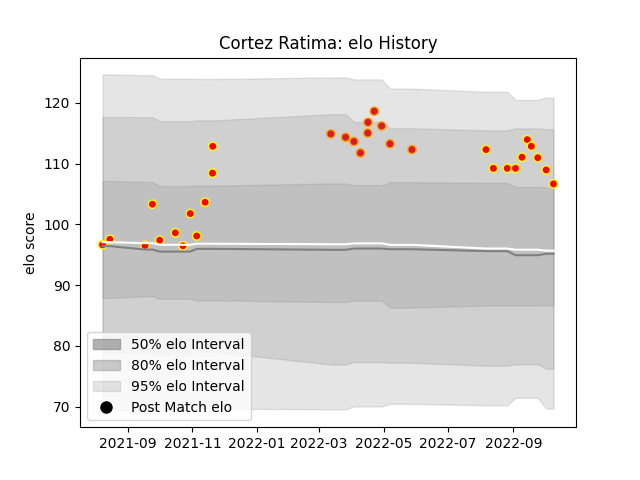

---  
layout: page  
title: Cortez Ratima  
date: 2023-02-24 09:53:56.890954  
categories: player  
---
# Cortez Ratima

## Positions: SH

## Current elo: 107.0

## Current Percentile: 87.0

# Elo History

# Match History

| Team    |   Appearances |   Win Rate |
|:--------|--------------:|-----------:|
| Waikato |            22 |   0.659091 |
| Chiefs  |            10 |   0.7      |

| Opponent                 |   Matches |   Win Rate |
|:-------------------------|----------:|-----------:|
| Tasman                   |         3 |   1        |
| Bay of Plenty            |         3 |   0.666667 |
| Moana Pasifika           |         2 |   1        |
| Hawke's Bay              |         2 |   0.25     |
| Taranaki                 |         2 |   0.5      |
| Otago                    |         2 |   0.5      |
| Northland                |         2 |   0.5      |
| Wellington               |         2 |   0.5      |
| Crusaders                |         2 |   0.5      |
| Canterbury               |         2 |   0.5      |
| Hurricanes               |         1 |   1        |
| Manawatu                 |         1 |   1        |
| Fijian Drua              |         1 |   1        |
| New South Wales Waratahs |         1 |   1        |
| North Harbour            |         1 |   1        |
| Queensland Reds          |         1 |   1        |
| Southland                |         1 |   1        |
| Brumbies                 |         1 |   0        |
| Blues                    |         1 |   0        |
| Auckland                 |         1 |   1        |