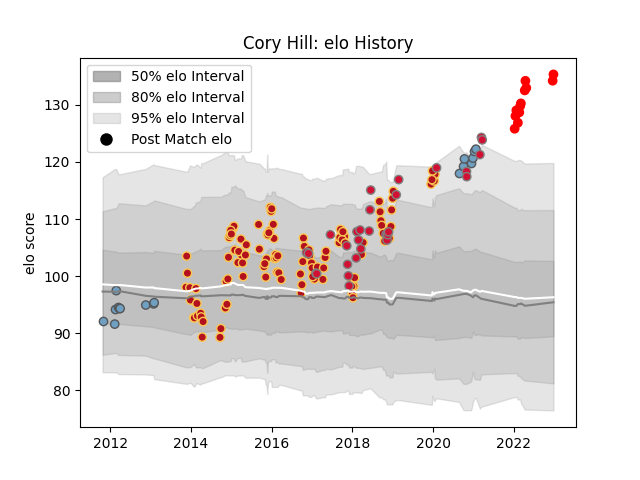

---  
layout: page  
title: Cory Hill  
date: 2023-03-21 18:21:53.503128  
categories: player  
---
# Cory Hill

Last updated: 2023-03-21
## Positions: L

## Country: Wales

## Current elo: 155.0

## Current Percentile: 99.0

# Elo History

# Match History

| Team                    |   Appearances |   Win Rate |
|:------------------------|--------------:|-----------:|
| Dragons                 |           112 |   0.388393 |
| Wales                   |            31 |   0.709677 |
| Cardiff Blues           |            18 |   0.5      |
| Yokohama Canon Eagles   |            10 |   0.6      |
| British and Irish Lions |             2 |   0.75     |

| Opponent                          |   Matches |   Win Rate |
|:----------------------------------|----------:|-----------:|
| Cardiff Blues                     |        12 |   0.25     |
| Scarlets                          |        12 |   0.25     |
| Benetton Treviso                  |         9 |   0.444444 |
| Zebre                             |         7 |   0.642857 |
| Edinburgh                         |         7 |   0.142857 |
| Connacht                          |         7 |   0.428571 |
| Leinster                          |         7 |   0.285714 |
| Munster                           |         7 |   0.142857 |
| Ospreys                           |         7 |   0.285714 |
| Glasgow Warriors                  |         7 |   0.285714 |
| Ulster                            |         5 |   0.4      |
| France                            |         4 |   0.5      |
| Newcastle Falcons                 |         4 |   0.5      |
| RC Enisei                         |         4 |   0.75     |
| South Africa                      |         4 |   1        |
| England                           |         4 |   0.5      |
| Italy                             |         4 |   1        |
| Scotland                          |         3 |   0.666667 |
| Australia                         |         3 |   0.333333 |
| Argentina                         |         3 |   1        |
| Castres Olympique                 |         3 |   0.333333 |
| Bucuresti                         |         2 |   1        |
| Tonga                             |         2 |   1        |
| Sale Sharks                       |         2 |   0.5      |
| Saitama Wild Knights              |         2 |   0        |
| Bordeaux Begles                   |         2 |   0.5      |
| Pau                               |         2 |   1        |
| Northampton Saints                |         2 |   0        |
| Southern Kings                    |         2 |   1        |
| Brive                             |         2 |   0.5      |
| London Irish                      |         2 |   0.5      |
| Kubota Spears Funabashi Tokyo-Bay |         2 |   0.5      |
| Dragons                           |         2 |   0.5      |
| Enisey-STM Krasnoyarsk            |         2 |   1        |
| Worcester Warriors                |         2 |   0.5      |
| Bucarest Wolves                   |         2 |   1        |
| Timisoara Saracens                |         1 |   1        |
| Stade Francais Paris              |         1 |   1        |
| Toshiba Brave Lupus Tokyo         |         1 |   0        |
| Black Rams Tokyo                  |         1 |   1        |
| Urayasu D-Rocks                   |         1 |   1        |
| Wasps                             |         1 |   1        |
| Shizuoka Blue Revs                |         1 |   1        |
| Georgia                           |         1 |   1        |
| Saracens                          |         1 |   0        |
| Exeter Chiefs                     |         1 |   0        |
| Cheetahs                          |         1 |   0        |
| New Zealand                       |         1 |   0        |
| Chiefs                            |         1 |   1        |
| Clermont Auvergne                 |         1 |   0        |
| Japan                             |         1 |   1        |
| Ireland                           |         1 |   0        |
| Hurricanes                        |         1 |   0.5      |
| Harlequins                        |         1 |   0        |
| Green Rockets Tokatsu             |         1 |   1        |
| Kobelco Kobe Steelers             |         1 |   1        |