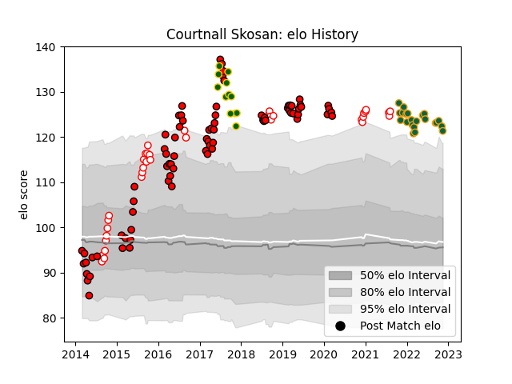

---  
layout: page  
title: Courtnall Skosan  
date: 2022-11-16 11:25:28.278717  
categories: player  
---
# Courtnall Skosan

## Positions: W

## Country: South Africa

## Current elo: 121.0

## Current Percentile: 96.0

# Elo History

# Match History

| Team               |   Appearances |   Win Rate |
|:-------------------|--------------:|-----------:|
| Lions              |            77 |   0.642857 |
| Golden Lions       |            36 |   0.722222 |
| Northampton Saints |            22 |   0.454545 |
| South Africa       |            12 |   0.666667 |

| Opponent                 |   Matches |   Win Rate |
|:-------------------------|----------:|-----------:|
| Sharks                   |        10 |   0.5      |
| Bulls                    |         8 |   0.5      |
| Stormers                 |         7 |   0.5      |
| Western Province         |         7 |   0.571429 |
| Jaguares                 |         7 |   0.714286 |
| Natal Sharks             |         6 |   0.666667 |
| Pumas                    |         6 |   0.833333 |
| Hurricanes               |         5 |   0.2      |
| Highlanders              |         5 |   0.6      |
| Griquas                  |         5 |   0.8      |
| Free State Cheetahs      |         5 |   1        |
| Crusaders                |         5 |   0.2      |
| Cheetahs                 |         5 |   1        |
| Blue Bulls               |         5 |   0.4      |
| Melbourne Rebels         |         4 |   0.75     |
| France                   |         4 |   1        |
| New South Wales Waratahs |         4 |   1        |
| Southern Kings           |         4 |   1        |
| Leicester Tigers         |         3 |   0        |
| Queensland Reds          |         3 |   1        |
| Sale Sharks              |         3 |   0        |
| Saracens                 |         3 |   0        |
| Sunwolves                |         3 |   1        |
| Blues                    |         3 |   0.666667 |
| Australia                |         2 |   0.5      |
| London Irish             |         2 |   1        |
| Exeter Chiefs            |         2 |   0.5      |
| Eastern Province Kings   |         2 |   1        |
| Chiefs                   |         2 |   0.5      |
| New Zealand              |         2 |   0        |
| Newcastle Falcons        |         2 |   1        |
| Wasps                    |         2 |   1        |
| Argentina                |         2 |   1        |
| Western Force            |         1 |   1        |
| Italy                    |         1 |   1        |
| Ireland                  |         1 |   0        |
| Harlequins               |         1 |   0        |
| Gloucester Rugby         |         1 |   0        |
| Brumbies                 |         1 |   1        |
| Bristol Rugby            |         1 |   1        |
| Bath Rugby               |         1 |   1        |
| Worcester Warriors       |         1 |   1        |