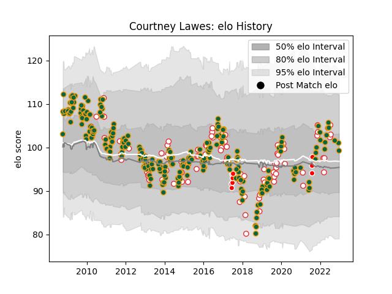

---  
layout: page  
title: Courtney Lawes  
date: 2023-01-17 11:37:54.182193  
categories: player  
---
# Courtney Lawes

## Positions: L, FL

## Country: England

## Current elo: 93.0

## Current Percentile: 40.0

# Elo History

# Match History

| Team                    |   Appearances |   Win Rate |
|:------------------------|--------------:|-----------:|
| Northampton Saints      |           254 |   0.594488 |
| England                 |            94 |   0.707447 |
| British and Irish Lions |            10 |   0.5      |

| Opponent                 |   Matches |   Win Rate |
|:-------------------------|----------:|-----------:|
| Saracens                 |        24 |   0.333333 |
| Harlequins               |        20 |   0.6      |
| Wasps                    |        20 |   0.5      |
| Leicester Tigers         |        19 |   0.342105 |
| Australia                |        17 |   0.823529 |
| Gloucester Rugby         |        16 |   0.59375  |
| Exeter Chiefs            |        14 |   0.428571 |
| Sale Sharks              |        14 |   0.642857 |
| Newcastle Falcons        |        13 |   0.769231 |
| London Irish             |        13 |   0.769231 |
| Bath Rugby               |        13 |   0.653846 |
| Wales                    |        12 |   0.583333 |
| Scotland                 |        10 |   0.75     |
| New Zealand              |        10 |   0.35     |
| France                   |        10 |   0.4      |
| Worcester Warriors       |        10 |   1        |
| Castres Olympique        |         9 |   0.555556 |
| Ireland                  |         9 |   0.777778 |
| South Africa             |         8 |   0.375    |
| Italy                    |         7 |   1        |
| Argentina                |         7 |   1        |
| Bristol Rugby            |         7 |   0.857143 |
| Munster                  |         6 |   0.166667 |
| Benetton Treviso         |         5 |   1        |
| Ospreys                  |         5 |   0.8      |
| Clermont Auvergne        |         5 |   0.2      |
| Yorkshire Carnegie       |         4 |   1        |
| Leeds                    |         4 |   1        |
| Leinster                 |         4 |   0.25     |
| Racing 92                |         3 |   0.166667 |
| Ulster                   |         3 |   0.666667 |
| Glasgow Warriors         |         3 |   0.666667 |
| London Welsh             |         3 |   1        |
| Cardiff Blues            |         3 |   0.666667 |
| Scarlets                 |         3 |   0.666667 |
| Samoa                    |         3 |   1        |
| Tonga                    |         2 |   1        |
| Perpignan                |         2 |   0.5      |
| Montpellier Herault      |         2 |   1        |
| Lyon                     |         2 |   1        |
| Fiji                     |         2 |   1        |
| Japan                    |         2 |   1        |
| Highlanders              |         1 |   0        |
| Dragons                  |         1 |   1        |
| Chiefs                   |         1 |   1        |
| Edinburgh                |         1 |   1        |
| Toulon                   |         1 |   1        |
| La Rochelle              |         1 |   0        |
| United States of America |         1 |   1        |
| Bourgoin-Jallieu         |         1 |   1        |
| Blues                    |         1 |   0        |
| Hurricanes               |         1 |   0.5      |