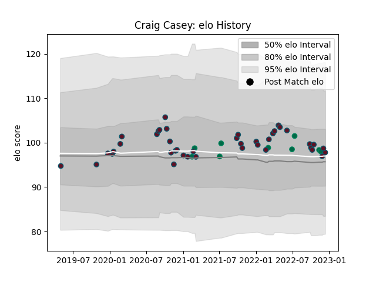

---  
layout: page  
title: Craig Casey  
date: 2022-11-16 11:33:28.200392  
categories: player  
---
# Craig Casey

## Positions: SH

## Country: Ireland

## Current elo: 99.0

## Current Percentile: 70.0

# Elo History

# Match History

| Team    |   Appearances |   Win Rate |
|:--------|--------------:|-----------:|
| Munster |            38 |   0.710526 |
| Ireland |             8 |   0.75     |

| Opponent                 |   Matches |   Win Rate |
|:-------------------------|----------:|-----------:|
| Connacht                 |         7 |   0.714286 |
| Ulster                   |         4 |   0.5      |
| Leinster                 |         4 |   0        |
| Ospreys                  |         4 |   0.75     |
| Zebre                    |         3 |   1        |
| Dragons                  |         3 |   0.666667 |
| Edinburgh                |         3 |   1        |
| Scarlets                 |         2 |   1        |
| Cardiff Blues            |         2 |   1        |
| Italy                    |         2 |   1        |
| New Zealand Maori        |         2 |   0.5      |
| United States of America |         1 |   1        |
| Stormers                 |         1 |   1        |
| Sharks                   |         1 |   1        |
| Benetton Treviso         |         1 |   1        |
| Racing 92                |         1 |   0        |
| Bulls                    |         1 |   1        |
| Glasgow Warriors         |         1 |   1        |
| France                   |         1 |   0        |
| Fiji                     |         1 |   1        |
| Japan                    |         1 |   1        |