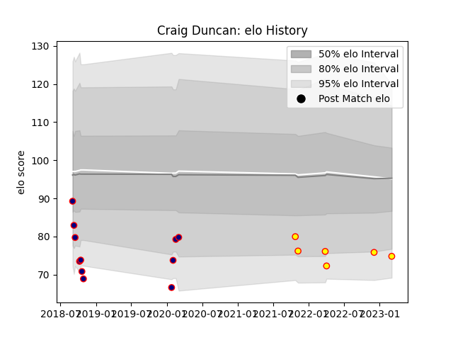

---  
layout: page  
title: Craig Duncan  
date: 2022-12-12 15:38:08.926708  
categories: player  
---
# Craig Duncan

## Positions: C, W

## Current elo: 86.0

## Current Percentile: 12.0

# Elo History

# Match History

| Team            |   Appearances |   Win Rate |
|:----------------|--------------:|-----------:|
| London Scottish |             6 |          0 |
| Richmond        |             2 |          0 |

| Opponent            |   Matches |   Win Rate |
|:--------------------|----------:|-----------:|
| Ealing Trailfinders |         3 |          0 |
| Ampthill            |         1 |          0 |
| Doncaster           |         1 |          0 |
| Jersey              |         1 |          0 |
| London Irish        |         1 |          0 |
| Richmond            |         1 |          0 |