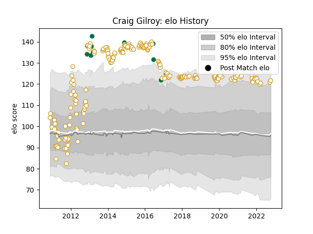

---  
layout: page  
title: Craig Gilroy  
date: 2023-02-24 02:29:29.370695  
categories: player  
---
# Craig Gilroy

## Positions: W

## Country: Ireland

## Current elo: 122.0

## Current Percentile: 90.0

# Elo History

# Match History

| Team    |   Appearances |   Win Rate |
|:--------|--------------:|-----------:|
| Ulster  |           204 |   0.696078 |
| Ireland |            11 |   0.636364 |

| Opponent            |   Matches |   Win Rate |
|:--------------------|----------:|-----------:|
| Scarlets            |        19 |   0.763158 |
| Leinster            |        17 |   0.352941 |
| Munster             |        16 |   0.46875  |
| Benetton Treviso    |        15 |   0.933333 |
| Ospreys             |        15 |   0.733333 |
| Cardiff Blues       |        15 |   0.7      |
| Connacht            |        15 |   0.666667 |
| Glasgow Warriors    |        13 |   0.769231 |
| Dragons             |        12 |   0.791667 |
| Zebre               |        10 |   0.9      |
| Edinburgh           |        10 |   0.8      |
| Leicester Tigers    |         6 |   0.666667 |
| Aironi              |         5 |   1        |
| Northampton Saints  |         4 |   0.5      |
| Saracens            |         4 |   0        |
| Harlequins          |         4 |   1        |
| Southern Kings      |         4 |   1        |
| Clermont Auvergne   |         3 |   0.666667 |
| Italy               |         2 |   0.5      |
| Cheetahs            |         2 |   0.5      |
| Castres Olympique   |         2 |   1        |
| Stade Toulousain    |         2 |   1        |
| South Africa        |         2 |   0.5      |
| Bordeaux Begles     |         2 |   0        |
| Wales               |         1 |   1        |
| Toulon              |         1 |   0        |
| Stormers            |         1 |   0        |
| Scotland            |         1 |   0        |
| Bath Rugby          |         1 |   1        |
| England             |         1 |   0        |
| Racing 92           |         1 |   0        |
| Oyonnax             |         1 |   1        |
| Exeter Chiefs       |         1 |   1        |
| Canada              |         1 |   1        |
| Montpellier Herault |         1 |   1        |
| Lions               |         1 |   1        |
| Argentina           |         1 |   1        |
| Georgia             |         1 |   1        |
| Fiji                |         1 |   1        |
| La Rochelle         |         1 |   1        |