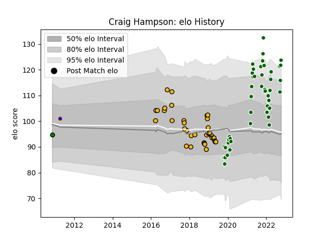

---  
layout: page  
title: Craig Hampson  
date: 2023-01-13 11:32:56.099742  
categories: player  
---
# Craig Hampson

## Positions: SH

## Current elo: 111.0

## Current Percentile: 91.0

# Elo History

# Match History

| Team                |   Appearances |   Win Rate |
|:--------------------|--------------:|-----------:|
| Ealing Trailfinders |            48 |   0.84375  |
| Wasps               |            38 |   0.355263 |
| Yorkshire Carnegie  |             1 |   0        |

| Opponent           |   Matches |   Win Rate |
|:-------------------|----------:|-----------:|
| Jersey             |         6 |   1        |
| Coventry           |         6 |   0.916667 |
| Ampthill           |         5 |   1        |
| Hartpury College   |         5 |   1        |
| Bath Rugby         |         5 |   0.1      |
| Doncaster          |         5 |   0.6      |
| Newcastle Falcons  |         4 |   0.25     |
| Richmond           |         4 |   1        |
| Nottingham         |         4 |   1        |
| Exeter Chiefs      |         4 |   0.25     |
| Bedford            |         4 |   0.75     |
| Saracens           |         3 |   0        |
| Cornish Pirates    |         3 |   0.666667 |
| Leicester Tigers   |         3 |   0.666667 |
| Northampton Saints |         3 |   0.666667 |
| Harlequins         |         3 |   0.333333 |
| Ospreys            |         2 |   0.5      |
| Stade Toulousain   |         2 |   0        |
| Sale Sharks        |         2 |   0        |
| Worcester Warriors |         2 |   1        |
| Leinster           |         2 |   0        |
| London Scottish    |         2 |   1        |
| Bristol Rugby      |         2 |   1        |
| London Irish       |         1 |   0        |
| Gloucester Rugby   |         1 |   0        |
| Scarlets           |         1 |   0        |
| Caldy              |         1 |   0        |
| Yorkshire Carnegie |         1 |   1        |
| Zebre              |         1 |   1        |