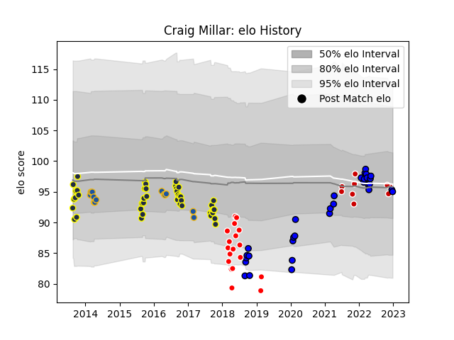

---  
layout: page  
title: Craig Millar  
date: 2022-11-22 11:35:38.826633  
categories: player  
---
# Craig Millar

## Positions: P

## Country: Japan

## Current elo: 97.0

## Current Percentile: 60.0

# Elo History

# Match History

| Team                 |   Appearances |   Win Rate |
|:---------------------|--------------:|-----------:|
| Otago                |            43 |   0.534884 |
| Sunwolves            |            18 |   0.166667 |
| Highlanders          |            13 |   0.538462 |
| Saitama Wild Knights |             9 |   1        |
| Japan                |             7 |   0.142857 |

| Opponent                          |   Matches |   Win Rate |
|:----------------------------------|----------:|-----------:|
| Bay of Plenty                     |         6 |   0.666667 |
| Melbourne Rebels                  |         4 |   0.5      |
| Hawke's Bay                       |         4 |   0.25     |
| Wellington                        |         4 |   0.5      |
| Tasman                            |         4 |   0.25     |
| Southland                         |         4 |   0.75     |
| Canterbury                        |         4 |   0        |
| Sharks                            |         4 |   0.25     |
| Northland                         |         4 |   0.75     |
| North Harbour                     |         4 |   0.75     |
| New South Wales Waratahs          |         3 |   0        |
| Manawatu                          |         3 |   1        |
| Auckland                          |         3 |   0.333333 |
| Blues                             |         3 |   0.333333 |
| Brumbies                          |         3 |   0.333333 |
| Crusaders                         |         3 |   0.333333 |
| Chiefs                            |         3 |   0        |
| Yokohama Canon Eagles             |         2 |   1        |
| Queensland Reds                   |         2 |   0.5      |
| Bulls                             |         2 |   1        |
| NTT Docomo Red Hurricanes Osaka   |         2 |   1        |
| Western Force                     |         1 |   0        |
| Waikato                           |         1 |   1        |
| Taranaki                          |         1 |   1        |
| Stormers                          |         1 |   1        |
| Shizuoka Blue Revs                |         1 |   1        |
| Scotland                          |         1 |   0        |
| Green Rockets Tokatsu             |         1 |   1        |
| Portugal                          |         1 |   1        |
| France                            |         1 |   0        |
| Counties Manukau                  |         1 |   0        |
| New Zealand                       |         1 |   0        |
| Mitsubishi Dynaboars              |         1 |   1        |
| Australia                         |         1 |   0        |
| England                           |         1 |   0        |
| Lions                             |         1 |   0        |
| Kubota Spears Funabashi Tokyo-Bay |         1 |   1        |
| Ireland                           |         1 |   0        |
| Hurricanes                        |         1 |   0        |
| Coca-Cola Red Sparks              |         1 |   1        |