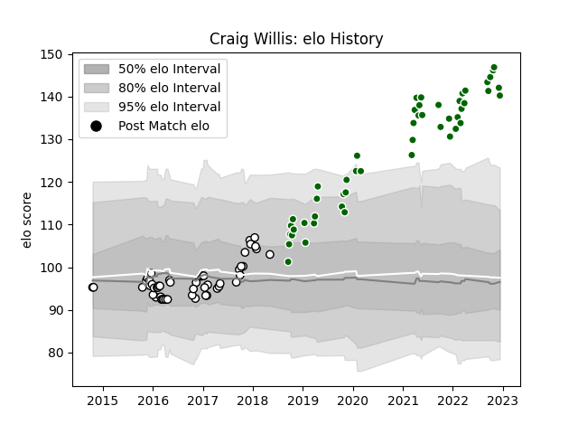

---  
layout: page  
title: Craig Willis  
date: 2023-03-21 18:52:22.033125  
categories: player  
---
# Craig Willis

Last updated: 2023-03-21
## Positions: FH

## Current elo: 150.0

## Current Percentile: 100.0

# Elo History

# Match History

| Team                |   Appearances |   Win Rate |
|:--------------------|--------------:|-----------:|
| Ealing Trailfinders |            61 |   0.844262 |
| Newcastle Falcons   |            52 |   0.519231 |

| Opponent               |   Matches |   Win Rate |
|:-----------------------|----------:|-----------:|
| Bedford                |         8 |   0.75     |
| Coventry               |         7 |   0.928571 |
| Nottingham             |         6 |   0.833333 |
| London Scottish        |         6 |   1        |
| Bath Rugby             |         6 |   0.666667 |
| Doncaster              |         6 |   0.666667 |
| Cornish Pirates        |         6 |   0.666667 |
| Ampthill               |         5 |   1        |
| Saracens               |         5 |   0        |
| Hartpury College       |         5 |   1        |
| Wasps                  |         4 |   0.25     |
| Richmond               |         4 |   1        |
| Jersey                 |         4 |   1        |
| Dragons                |         3 |   1        |
| Worcester Warriors     |         3 |   0.666667 |
| RC Enisei              |         3 |   1        |
| Leicester Tigers       |         3 |   0.333333 |
| London Irish           |         3 |   0.666667 |
| Connacht               |         2 |   0.5      |
| Bordeaux Begles        |         2 |   1        |
| Ospreys                |         2 |   0        |
| Northampton Saints     |         2 |   0.5      |
| Yorkshire Carnegie     |         2 |   1        |
| Brive                  |         2 |   0.5      |
| Harlequins             |         2 |   0.5      |
| Grenoble               |         2 |   0.5      |
| Gloucester Rugby       |         2 |   0        |
| Exeter Chiefs          |         2 |   0        |
| Newcastle Falcons      |         1 |   0        |
| Bristol Rugby          |         1 |   1        |
| Bucuresti              |         1 |   1        |
| Sale Sharks            |         1 |   0        |
| Enisey-STM Krasnoyarsk |         1 |   1        |
| Lyon                   |         1 |   1        |