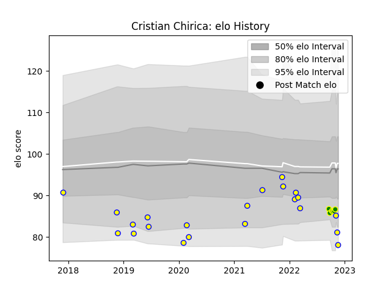

---  
layout: page  
title: Cristian Chirica  
date: 2023-01-23 15:31:26.614160  
categories: player  
---
# Cristian Chirica

## Positions: N8, FL

## Country: Romania

## Current elo: 64.0

## Current Percentile: 2.0

# Elo History

# Match History

| Team                |   Appearances |   Win Rate |
|:--------------------|--------------:|-----------:|
| Romania             |            27 |   0.481481 |
| Carqueiranne-Hyères |             7 |   0.571429 |

| Opponent                   |   Matches |   Win Rate |
|:---------------------------|----------:|-----------:|
| Georgia                    |         4 |   0        |
| Russia                     |         4 |   0.5      |
| Uruguay                    |         3 |   0.333333 |
| Spain                      |         3 |   0.333333 |
| Albi                       |         2 |   0.5      |
| Tonga                      |         2 |   0.5      |
| Portugal                   |         2 |   1        |
| Chile                      |         2 |   1        |
| Cognac Saint Jean d'Angély |         1 |   1        |
| Germany                    |         1 |   1        |
| Netherlands                |         1 |   1        |
| Argentina                  |         1 |   0        |
| Samoa                      |         1 |   0        |
| Chambery                   |         1 |   1        |
| Tarbes                     |         1 |   1        |
| Canada                     |         1 |   1        |
| US Bressane                |         1 |   0        |
| United States of America   |         1 |   0        |
| Brazil                     |         1 |   1        |
| Valence Romans Drome Rugby |         1 |   0        |