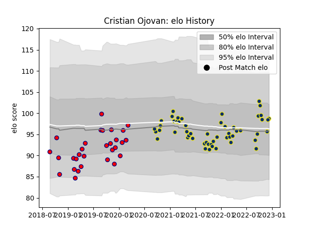

---  
layout: page  
title: Cristian Ojovan  
date: 2022-12-18 16:39:00.024600  
categories: player  
---
# Cristian Ojovan

## Positions: P

## Current elo: 99.0

## Current Percentile: 61.0

# Elo History

# Match History

| Team              |   Appearances |   Win Rate |
|:------------------|--------------:|-----------:|
| Clermont Auvergne |            53 |   0.54717  |
| Aurillac          |            30 |   0.433333 |

| Opponent             |   Matches |   Win Rate |
|:---------------------|----------:|-----------:|
| Bordeaux Begles      |         6 |   0.333333 |
| Racing 92            |         5 |   0.2      |
| Biarritz Olympique   |         5 |   0.6      |
| Brive                |         5 |   0.8      |
| Lyon                 |         5 |   0.6      |
| Stade Toulousain     |         4 |   0.25     |
| Pau                  |         4 |   0.75     |
| Stade Francais Paris |         4 |   0.5      |
| Perpignan            |         4 |   0.5      |
| Toulon               |         4 |   0.5      |
| Castres Olympique    |         3 |   0.333333 |
| Mont-de-Marsan       |         3 |   0        |
| Beziers              |         3 |   0.333333 |
| Bayonne              |         3 |   0.666667 |
| Provence Rugby       |         3 |   0.666667 |
| Vannes               |         3 |   0.333333 |
| Rouen                |         2 |   1        |
| Agen                 |         2 |   1        |
| Oyonnax              |         2 |   0.5      |
| La Rochelle          |         2 |   1        |
| Carcassonne          |         2 |   0.5      |
| Montpellier Herault  |         2 |   0.5      |
| Nevers               |         1 |   0        |
| Montauban            |         1 |   0        |
| Massy                |         1 |   1        |
| Roval Drome XV       |         1 |   0        |
| Grenoble             |         1 |   0        |
| Stormers             |         1 |   1        |
| US Bressane          |         1 |   1        |