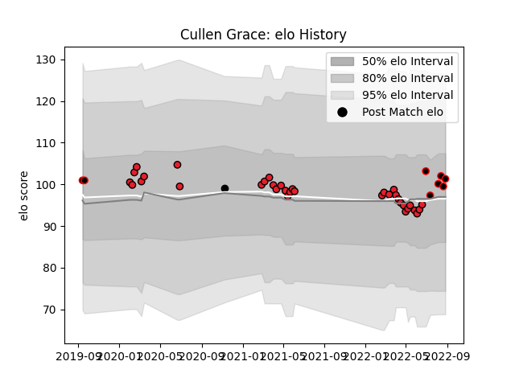

---  
layout: page  
title: Cullen Grace  
date: 2023-02-24 09:48:13.322585  
categories: player  
---
# Cullen Grace

## Positions: N8, FL

## Country: New Zealand Maori

## Current elo: 101.0

## Current Percentile: 58.0

# Elo History

# Match History

| Team              |   Appearances |   Win Rate |
|:------------------|--------------:|-----------:|
| Crusaders         |            34 |   0.852941 |
| Canterbury        |             6 |   0.666667 |
| New Zealand Maori |             2 |   0.5      |
| New Zealand       |             1 |   0        |

| Opponent                 |   Matches |   Win Rate |
|:-------------------------|----------:|-----------:|
| Chiefs                   |         6 |   0.666667 |
| Highlanders              |         5 |   0.8      |
| Hurricanes               |         5 |   1        |
| Blues                    |         5 |   0.8      |
| Queensland Reds          |         4 |   1        |
| New South Wales Waratahs |         3 |   0.666667 |
| Western Force            |         2 |   1        |
| Brumbies                 |         2 |   1        |
| Ireland                  |         2 |   0.5      |
| Manawatu                 |         2 |   0.5      |
| Taranaki                 |         1 |   0        |
| Wellington               |         1 |   1        |
| Tasman                   |         1 |   1        |
| Australia                |         1 |   0        |
| Sunwolves                |         1 |   1        |
| Northland                |         1 |   1        |
| Melbourne Rebels         |         1 |   1        |