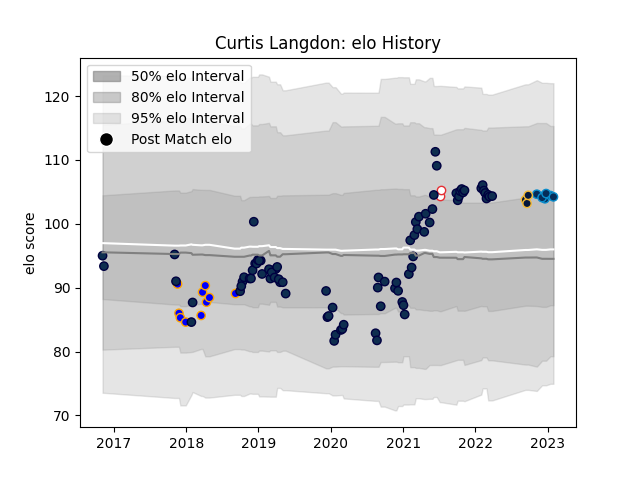

---  
layout: page  
title: Curtis Langdon  
date: 2023-02-02 19:08:50.139448  
categories: player  
---
# Curtis Langdon

## Positions: H

## Country: England

## Current elo: 104.0

## Current Percentile: 75.0

# Elo History

# Match History

| Team                |   Appearances |   Win Rate |
|:--------------------|--------------:|-----------:|
| Sale Sharks         |            81 |   0.623457 |
| Doncaster           |            10 |   0.15     |
| Montpellier Herault |             7 |   0.428571 |
| Worcester Warriors  |             3 |   0.333333 |
| England             |             2 |   1        |

| Opponent                 |   Matches |   Win Rate |
|:-------------------------|----------:|-----------:|
| Exeter Chiefs            |        11 |   0.181818 |
| Bristol Rugby            |         8 |   0.5625   |
| Northampton Saints       |         8 |   0.75     |
| Gloucester Rugby         |         7 |   0.857143 |
| London Irish             |         7 |   0.714286 |
| Leicester Tigers         |         6 |   0.666667 |
| Worcester Warriors       |         6 |   0.666667 |
| Harlequins               |         6 |   0.666667 |
| Newcastle Falcons        |         5 |   0.6      |
| Wasps                    |         4 |   0.75     |
| Saracens                 |         4 |   0.75     |
| Bath Rugby               |         4 |   0.5      |
| Connacht                 |         3 |   0.666667 |
| Perpignan                |         3 |   1        |
| La Rochelle              |         2 |   0        |
| Bedford                  |         2 |   0.25     |
| Ealing Trailfinders      |         2 |   0.5      |
| Bordeaux Begles          |         2 |   0.5      |
| Ospreys                  |         2 |   0        |
| Glasgow Warriors         |         1 |   0        |
| Stade Toulousain         |         1 |   0        |
| Canada                   |         1 |   1        |
| United States of America |         1 |   1        |
| Toulon                   |         1 |   1        |
| Richmond                 |         1 |   0        |
| Scarlets                 |         1 |   1        |
| Clermont Auvergne        |         1 |   0        |
| Jersey                   |         1 |   0        |
| Cornish Pirates          |         1 |   0        |
| Yorkshire Carnegie       |         1 |   0        |