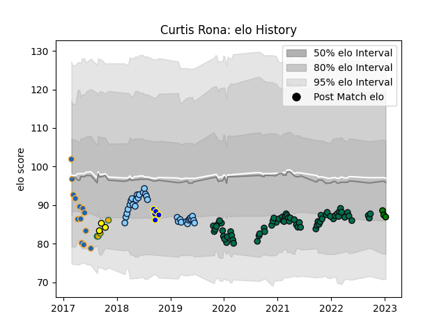

---  
layout: page  
title: Curtis Rona  
date: 2023-03-21 18:52:53.441742  
categories: player  
---
# Curtis Rona

Last updated: 2023-03-21
## Positions: C, W

## Country: Australia

## Current elo: 85.0

## Current Percentile: 20.0

# Elo History

# Match History

| Team                     |   Appearances |   Win Rate |
|:-------------------------|--------------:|-----------:|
| London Irish             |            67 |   0.440299 |
| New South Wales Waratahs |            31 |   0.5      |
| Western Force            |            14 |   0.428571 |
| Sydney Rays              |             5 |   0        |
| Australia                |             4 |   0.375    |
| Perth Spirit             |             3 |   0.666667 |
| Mitsubishi Dynaboars     |             1 |   1        |

| Opponent                 |   Matches |   Win Rate |
|:-------------------------|----------:|-----------:|
| Worcester Warriors       |         6 |   0.5      |
| Exeter Chiefs            |         6 |   0.5      |
| Wasps                    |         6 |   0.416667 |
| Sale Sharks              |         6 |   0.166667 |
| Queensland Reds          |         6 |   1        |
| Bristol Rugby            |         6 |   0.333333 |
| Leicester Tigers         |         6 |   0.333333 |
| Brumbies                 |         5 |   0.2      |
| Melbourne Rebels         |         5 |   1        |
| Harlequins               |         5 |   0.5      |
| Newcastle Falcons        |         4 |   0.75     |
| Lions                    |         4 |   0        |
| Highlanders              |         4 |   0.5      |
| Gloucester Rugby         |         4 |   0.625    |
| Bath Rugby               |         4 |   0.25     |
| Sharks                   |         3 |   0.166667 |
| Jaguares                 |         3 |   0.333333 |
| Sunwolves                |         3 |   1        |
| Saracens                 |         3 |   0.333333 |
| Northampton Saints       |         3 |   0.333333 |
| Crusaders                |         2 |   0        |
| Chiefs                   |         2 |   0        |
| Hurricanes               |         2 |   0        |
| Toulon                   |         2 |   0        |
| Melbourne Rising         |         2 |   0.5      |
| NSW Country Eagles       |         2 |   0        |
| New South Wales Waratahs |         2 |   0.5      |
| New Zealand              |         2 |   0        |
| Fijian Drua              |         1 |   0        |
| South Africa             |         1 |   0.5      |
| Stormers                 |         1 |   1        |
| Southern Kings           |         1 |   1        |
| Black Rams Tokyo         |         1 |   1        |
| Scarlets                 |         1 |   0        |
| Bulls                    |         1 |   0        |
| Blues                    |         1 |   0        |
| Brisbane City            |         1 |   0        |
| Pau                      |         1 |   1        |
| Edinburgh                |         1 |   1        |
| Canberra Vikings         |         1 |   0        |
| Cardiff Blues            |         1 |   1        |
| Castres Olympique        |         1 |   1        |
| Bayonne                  |         1 |   1        |
| Greater Sydney Rams      |         1 |   1        |
| Japan                    |         1 |   1        |