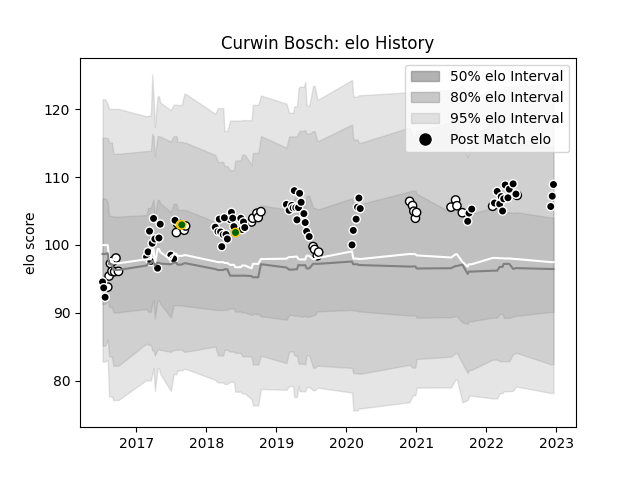

---  
layout: page  
title: Curwin Bosch  
date: 2022-12-18 16:28:32.161780  
categories: player  
---
# Curwin Bosch

## Positions: FH, FB

## Country: South Africa

## Current elo: 109.0

## Current Percentile: 81.0

# Elo History

# Match History

| Team         |   Appearances |   Win Rate |
|:-------------|--------------:|-----------:|
| Sharks       |            70 |   0.564286 |
| Natal Sharks |            32 |   0.625    |
| South Africa |             3 |   0.666667 |

| Opponent                 |   Matches |   Win Rate |
|:-------------------------|----------:|-----------:|
| Lions                    |         8 |   0.5      |
| Bulls                    |         8 |   0.25     |
| Western Province         |         7 |   0.285714 |
| Jaguares                 |         7 |   0.571429 |
| Griquas                  |         7 |   0.714286 |
| Free State Cheetahs      |         5 |   0.6      |
| Pumas                    |         5 |   0.8      |
| Melbourne Rebels         |         4 |   0.625    |
| Stormers                 |         3 |   0.666667 |
| Blue Bulls               |         3 |   1        |
| Brumbies                 |         3 |   0.333333 |
| Hurricanes               |         3 |   0        |
| Queensland Reds          |         3 |   0.333333 |
| New South Wales Waratahs |         3 |   0.833333 |
| Golden Lions             |         3 |   0.333333 |
| Highlanders              |         2 |   1        |
| Argentina                |         2 |   1        |
| Sunwolves                |         2 |   1        |
| Crusaders                |         2 |   0.25     |
| Chiefs                   |         2 |   0.5      |
| Cheetahs                 |         2 |   1        |
| Blues                    |         2 |   1        |
| Scarlets                 |         1 |   1        |
| Southern Kings           |         1 |   1        |
| Ulster                   |         1 |   0        |
| Wales                    |         1 |   0        |
| Western Force            |         1 |   1        |
| Ospreys                  |         1 |   1        |
| Harlequins               |         1 |   1        |
| Munster                  |         1 |   0        |
| Leinster                 |         1 |   1        |
| Benetton Treviso         |         1 |   1        |
| Glasgow Warriors         |         1 |   0        |
| Edinburgh                |         1 |   0        |
| Eastern Province Kings   |         1 |   1        |
| Dragons                  |         1 |   1        |
| Connacht                 |         1 |   1        |
| Cardiff Blues            |         1 |   0        |
| Bordeaux Begles          |         1 |   1        |
| Boland Cavaliers         |         1 |   1        |
| Zebre                    |         1 |   1        |