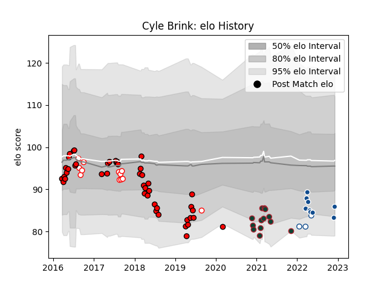

---  
layout: page  
title: Cyle Brink  
date: 2022-12-09 13:09:58.588565  
categories: player  
---
# Cyle Brink

## Positions: FL

## Current elo: 86.0

## Current Percentile: 11.0

# Elo History

# Match History

| Team             |   Appearances |   Win Rate |
|:-----------------|--------------:|-----------:|
| Lions            |            45 |   0.555556 |
| Leicester Tigers |            13 |   0.461538 |
| Golden Lions     |            12 |   0.5      |
| Bulls            |             9 |   0.888889 |
| Blue Bulls       |             3 |   1        |

| Opponent                 |   Matches |   Win Rate |
|:-------------------------|----------:|-----------:|
| Sharks                   |         8 |   0.625    |
| Jaguares                 |         6 |   0.5      |
| Crusaders                |         6 |   0.166667 |
| Bulls                    |         5 |   0.8      |
| Hurricanes               |         4 |   0.25     |
| Stormers                 |         4 |   0.75     |
| Griquas                  |         4 |   0.75     |
| Natal Sharks             |         3 |   0.666667 |
| Southern Kings           |         2 |   1        |
| Sale Sharks              |         2 |   0        |
| London Irish             |         2 |   0.5      |
| Highlanders              |         2 |   0.5      |
| Gloucester Rugby         |         2 |   1        |
| Free State Cheetahs      |         2 |   0        |
| Ospreys                  |         2 |   1        |
| Exeter Chiefs            |         2 |   0        |
| Western Province         |         2 |   0.5      |
| Blues                    |         2 |   0.5      |
| Blue Bulls               |         2 |   0.5      |
| Pumas                    |         2 |   1        |
| Ulster                   |         1 |   1        |
| Wasps                    |         1 |   1        |
| Western Force            |         1 |   1        |
| Scarlets                 |         1 |   1        |
| Queensland Reds          |         1 |   0        |
| Bath Rugby               |         1 |   1        |
| Northampton Saints       |         1 |   0        |
| New South Wales Waratahs |         1 |   0        |
| Melbourne Rebels         |         1 |   1        |
| Benetton Treviso         |         1 |   1        |
| Harlequins               |         1 |   0        |
| Glasgow Warriors         |         1 |   1        |
| Dragons                  |         1 |   1        |
| Chiefs                   |         1 |   1        |
| Cheetahs                 |         1 |   1        |
| Cardiff Blues            |         1 |   1        |
| Brumbies                 |         1 |   0        |
| Worcester Warriors       |         1 |   1        |