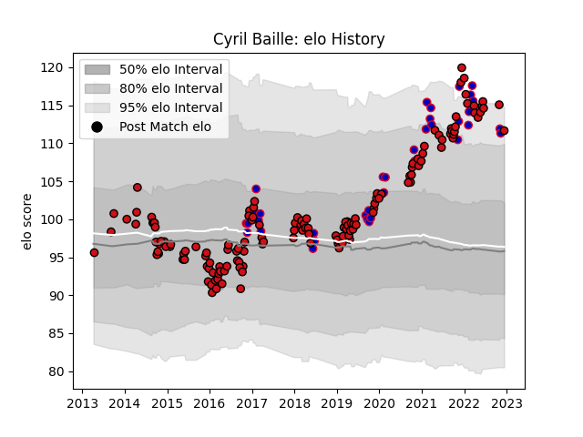

---  
layout: page  
title: Cyril Baille  
date: 2022-11-16 11:28:51.054330  
categories: player  
---
# Cyril Baille

## Positions: P

## Country: France

## Current elo: 112.0

## Current Percentile: 92.0

# Elo History

# Match History

| Team             |   Appearances |   Win Rate |
|:-----------------|--------------:|-----------:|
| Stade Toulousain |           142 |   0.616197 |
| France           |            36 |   0.722222 |

| Opponent                 |   Matches |   Win Rate |
|:-------------------------|----------:|-----------:|
| Clermont Auvergne        |        15 |   0.5      |
| Racing 92                |        13 |   0.538462 |
| La Rochelle              |        10 |   0.7      |
| Bordeaux Begles          |        10 |   0.75     |
| Montpellier Herault      |         9 |   0.666667 |
| Toulon                   |         9 |   0.611111 |
| Castres Olympique        |         9 |   0.444444 |
| Stade Francais Paris     |         8 |   0.875    |
| Wales                    |         6 |   0.833333 |
| Oyonnax                  |         6 |   0.75     |
| Brive                    |         6 |   0.833333 |
| Pau                      |         5 |   0.8      |
| Lyon                     |         5 |   0.4      |
| Italy                    |         5 |   1        |
| New Zealand              |         5 |   0.2      |
| Ireland                  |         4 |   0.75     |
| Agen                     |         4 |   1        |
| England                  |         4 |   0.5      |
| Perpignan                |         3 |   0.333333 |
| Scotland                 |         3 |   0.666667 |
| Connacht                 |         3 |   0.666667 |
| Ulster                   |         3 |   0.333333 |
| Bayonne                  |         3 |   0.333333 |
| Wasps                    |         3 |   0.166667 |
| Leinster                 |         2 |   0        |
| Munster                  |         2 |   0        |
| Argentina                |         2 |   1        |
| Australia                |         2 |   0.5      |
| Bath Rugby               |         2 |   1        |
| Biarritz Olympique       |         2 |   1        |
| Zebre                    |         2 |   1        |
| Gloucester Rugby         |         2 |   1        |
| Grenoble                 |         2 |   0.5      |
| Saracens                 |         1 |   0        |
| Georgia                  |         1 |   1        |
| Samoa                    |         1 |   1        |
| Exeter Chiefs            |         1 |   0        |
| Tonga                    |         1 |   1        |
| Cardiff Blues            |         1 |   1        |
| Glasgow Warriors         |         1 |   1        |
| United States of America |         1 |   1        |
| South Africa             |         1 |   1        |