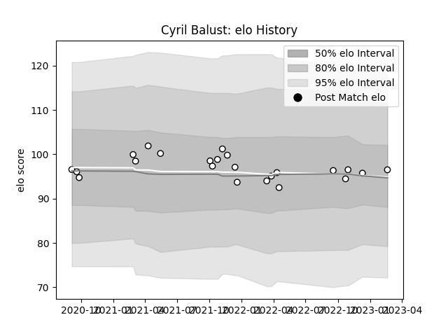

---  
layout: page  
title: Cyril Balust  
date: 2022-12-14 11:13:04.669915  
categories: player  
---
# Cyril Balust

## Positions: P

## Current elo: 94.0

## Current Percentile: 42.0

# Elo History

# Match History

| Team                       |   Appearances |   Win Rate |
|:---------------------------|--------------:|-----------:|
| Valence Romans Drome Rugby |             9 |   0.388889 |

| Opponent         |   Matches |   Win Rate |
|:-----------------|----------:|-----------:|
| Suresnes         |         2 |        1   |
| Bourgoin-Jallieu |         1 |        0.5 |
| Chambery         |         1 |        0   |
| Dijon            |         1 |        0   |
| Perpignan        |         1 |        0   |
| Rennes           |         1 |        1   |
| Tarbes           |         1 |        0   |
| Vannes           |         1 |        0   |