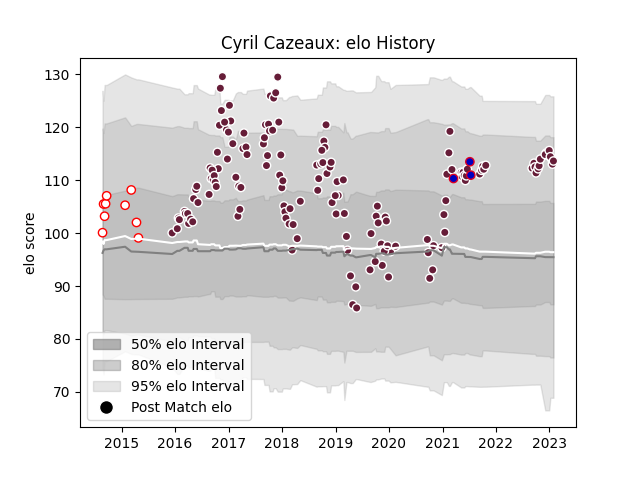

---  
layout: page  
title: Cyril Cazeaux  
date: 2023-02-02 19:14:25.830402  
categories: player  
---
# Cyril Cazeaux

## Positions: L

## Country: France

## Current elo: 114.0

## Current Percentile: 84.0

# Elo History

# Match History

| Team            |   Appearances |   Win Rate |
|:----------------|--------------:|-----------:|
| Bordeaux Begles |           150 |   0.523333 |
| Dax             |             9 |   0.166667 |
| France          |             3 |   0.333333 |

| Opponent             |   Matches |   Win Rate |
|:---------------------|----------:|-----------:|
| Clermont Auvergne    |        14 |   0.535714 |
| Stade Toulousain     |        11 |   0.227273 |
| Lyon                 |        10 |   0.6      |
| Toulon               |        10 |   0.4      |
| Stade Francais Paris |        10 |   0.7      |
| Montpellier Herault  |        10 |   0.4      |
| Racing 92            |         9 |   0.555556 |
| Castres Olympique    |         9 |   0.222222 |
| La Rochelle          |         8 |   0.5      |
| Brive                |         8 |   0.625    |
| Pau                  |         8 |   0.5      |
| Agen                 |         7 |   1        |
| Grenoble             |         5 |   0.8      |
| Bayonne              |         5 |   0.6      |
| Perpignan            |         5 |   0.7      |
| Oyonnax              |         3 |   0.666667 |
| Edinburgh            |         2 |   1        |
| Sharks               |         2 |   0        |
| Exeter Chiefs        |         2 |   0.5      |
| Gloucester Rugby     |         2 |   0        |
| Dragons              |         2 |   0.5      |
| Albi                 |         2 |   0        |
| Connacht             |         2 |   0        |
| Australia            |         2 |   0.5      |
| RC Enisei            |         2 |   1        |
| Bourgoin-Jallieu     |         2 |   0.25     |
| Ulster               |         1 |   1        |
| Tarbes               |         1 |   0        |
| Carcassonne          |         1 |   0        |
| Sale Sharks          |         1 |   0        |
| Bristol Rugby        |         1 |   0        |
| England              |         1 |   0        |
| Ospreys              |         1 |   0        |
| Newcastle Falcons    |         1 |   0        |
| Montauban            |         1 |   1        |
| Wasps                |         1 |   1        |