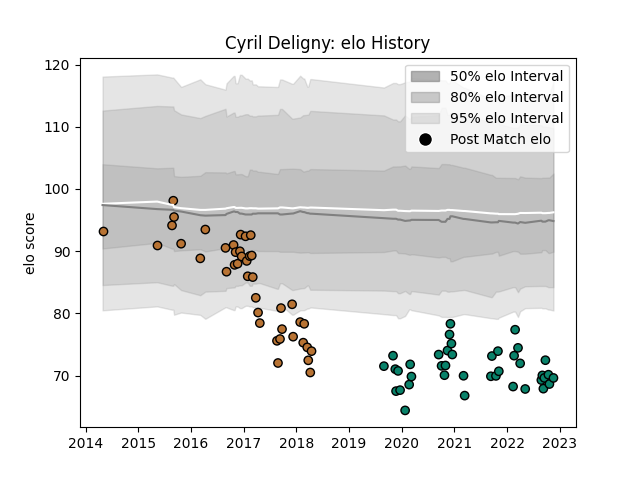

---  
layout: page  
title: Cyril Deligny  
date: 2023-01-06 11:43:16.444561  
categories: player  
---
# Cyril Deligny

## Positions: H

## Current elo: 79.0

## Current Percentile: 6.0

# Elo History

# Match History

| Team      |   Appearances |   Win Rate |
|:----------|--------------:|-----------:|
| Narbonne  |            81 |   0.364198 |
| Montauban |            65 |   0.430769 |

| Opponent                   |   Matches |   Win Rate |
|:---------------------------|----------:|-----------:|
| Carcassonne                |        11 |   0.272727 |
| Aurillac                   |        10 |   0.5      |
| Beziers                    |        10 |   0.2      |
| Colomiers                  |        10 |   0.45     |
| Vannes                     |         9 |   0.388889 |
| Oyonnax                    |         8 |   0.375    |
| Biarritz Olympique         |         8 |   0.375    |
| Soyaux-Angouleme           |         7 |   0.5      |
| Mont-de-Marsan             |         7 |   0.428571 |
| Agen                       |         6 |   0.5      |
| Montauban                  |         5 |   0.2      |
| Provence Rugby             |         5 |   0.4      |
| Bayonne                    |         5 |   0.2      |
| Nevers                     |         5 |   0.4      |
| Bourgoin-Jallieu           |         5 |   0.6      |
| Grenoble                   |         5 |   0.4      |
| Perpignan                  |         4 |   0        |
| Albi                       |         3 |   0.166667 |
| Dax                        |         3 |   0.666667 |
| Rouen                      |         3 |   0.666667 |
| Tarbes                     |         3 |   0.666667 |
| Pau                        |         3 |   0        |
| Narbonne                   |         2 |   1        |
| Massy                      |         2 |   0.5      |
| Lyon                       |         2 |   0.5      |
| Roval Drome XV             |         2 |   1        |
| Auch                       |         1 |   0        |
| US Bressane                |         1 |   0.5      |
| Valence Romans Drome Rugby |         1 |   0        |