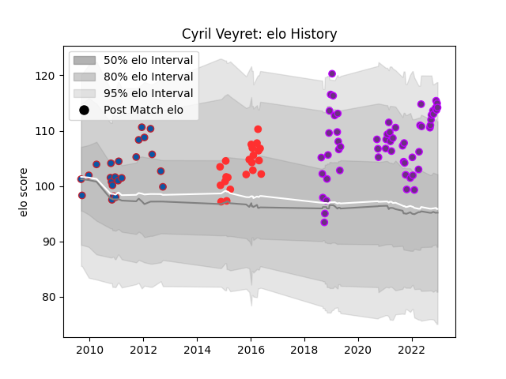

---  
layout: page  
title: Cyril Veyret  
date: 2022-11-22 11:44:40.751791  
categories: player  
---
# Cyril Veyret

## Positions: L

## Current elo: 114.0

## Current Percentile: 91.0

# Elo History

# Match History

| Team        |   Appearances |   Win Rate |
|:------------|--------------:|-----------:|
| US Bressane |            54 |   0.583333 |
| Grenoble    |            23 |   0.630435 |
| Tarbes      |            22 |   0.340909 |

| Opponent                   |   Matches |   Win Rate |
|:---------------------------|----------:|-----------:|
| Narbonne                   |         7 |   0.428571 |
| Colomiers                  |         6 |   0.5      |
| Dax                        |         5 |   0.4      |
| Carcassonne                |         5 |   0.6      |
| Montauban                  |         5 |   0.4      |
| Mont-de-Marsan             |         5 |   0.6      |
| Beziers                    |         5 |   0.6      |
| Aurillac                   |         5 |   0.6      |
| Provence Rugby             |         4 |   0.625    |
| Oyonnax                    |         4 |   0.5      |
| Bayonne                    |         4 |   0.25     |
| Albi                       |         4 |   0.5      |
| Bourgoin-Jallieu           |         4 |   0.75     |
| Blagnac                    |         3 |   1        |
| Massy                      |         3 |   0.666667 |
| Pau                        |         3 |   0.833333 |
| Rouen                      |         2 |   0.75     |
| Perpignan                  |         2 |   0        |
| Suresnes                   |         2 |   1        |
| Vannes                     |         2 |   0.25     |
| Lyon                       |         2 |   0.5      |
| Chambery                   |         2 |   1        |
| Bordeaux Begles            |         2 |   0.25     |
| Biarritz Olympique         |         2 |   0.5      |
| Auch                       |         2 |   0.5      |
| Grenoble                   |         1 |   0        |
| Cognac Saint Jean d'Angély |         1 |   1        |
| Clermont Auvergne          |         1 |   0        |
| Nice                       |         1 |   0        |
| Castres Olympique          |         1 |   0        |
| Carqueiranne-Hyères        |         1 |   1        |
| Soyaux-Angouleme           |         1 |   1        |
| Tarbes                     |         1 |   0        |
| Agen                       |         1 |   1        |