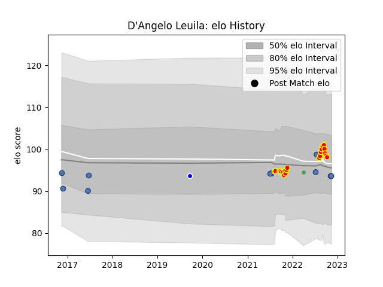

---  
layout: page  
title: D'Angelo Leuila  
date: 2022-11-22 11:44:14.566574  
categories: player  
---
# D'Angelo Leuila

## Positions: C, FH

## Country: Samoa

## Current elo: 94.0

## Current Percentile: 43.0

# Elo History

# Match History

| Team           |   Appearances |   Win Rate |
|:---------------|--------------:|-----------:|
| Waikato        |            21 |   0.642857 |
| Samoa          |            12 |   0.583333 |
| Auckland       |             1 |   0        |
| Moana Pasifika |             1 |   0        |

| Opponent          |   Matches |   Win Rate |
|:------------------|----------:|-----------:|
| Bay of Plenty     |         3 |   0.666667 |
| Tonga             |         3 |   1        |
| Wellington        |         3 |   0.333333 |
| Canterbury        |         2 |   0.5      |
| Northland         |         2 |   0.5      |
| Tasman            |         2 |   1        |
| Hawke's Bay       |         2 |   0.25     |
| Taranaki          |         2 |   0.5      |
| Otago             |         2 |   0.5      |
| Wales             |         1 |   0        |
| Canada            |         1 |   1        |
| Southland         |         1 |   1        |
| Romania           |         1 |   1        |
| North Harbour     |         1 |   1        |
| Counties Manukau  |         1 |   1        |
| New Zealand Maori |         1 |   0        |
| Blues             |         1 |   0        |
| Manawatu          |         1 |   1        |
| Italy             |         1 |   0        |
| Georgia           |         1 |   1        |
| France            |         1 |   0        |
| Fiji              |         1 |   1        |
| New Zealand       |         1 |   0        |