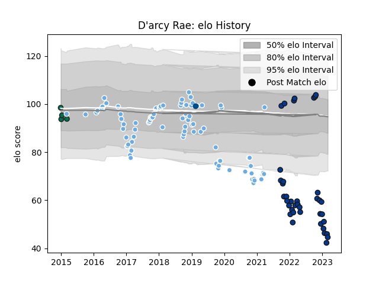

---  
layout: page  
title: D'arcy Rae  
date: 2023-01-25 18:58:13.551312  
categories: player  
---
# D'arcy Rae

## Positions: P

## Country: Scotland

## Current elo: 64.0

## Current Percentile: 92.0

# Elo History

# Match History

| Team             |   Appearances |   Win Rate |
|:-----------------|--------------:|-----------:|
| Glasgow Warriors |            85 |   0.552941 |
| Bath Rugby       |            33 |   0.272727 |
| Benetton Treviso |             4 |   0.5      |
| Scotland         |             1 |   0        |

| Opponent           |   Matches |   Win Rate |
|:-------------------|----------:|-----------:|
| Zebre              |        10 |   1        |
| Ospreys            |         9 |   0.611111 |
| Munster            |         9 |   0.222222 |
| Leinster           |         8 |   0.25     |
| Cardiff Blues      |         7 |   1        |
| Dragons            |         7 |   0.5      |
| Ulster             |         6 |   0.166667 |
| Benetton Treviso   |         6 |   0.833333 |
| Exeter Chiefs      |         6 |   0.166667 |
| Edinburgh          |         6 |   0.166667 |
| Saracens           |         5 |   0        |
| Scarlets           |         4 |   0.5      |
| Leicester Tigers   |         4 |   0.5      |
| Newcastle Falcons  |         4 |   0.75     |
| Connacht           |         4 |   0.5      |
| Northampton Saints |         3 |   0.333333 |
| Harlequins         |         3 |   0.333333 |
| Cheetahs           |         3 |   1        |
| Sale Sharks        |         3 |   0.5      |
| Wasps              |         2 |   0        |
| Toulon             |         2 |   0        |
| Southern Kings     |         2 |   0.5      |
| Glasgow Warriors   |         2 |   0.25     |
| Gloucester Rugby   |         2 |   0        |
| Bristol Rugby      |         2 |   0.5      |
| Lyon               |         1 |   1        |
| Ireland            |         1 |   0        |
| Worcester Warriors |         1 |   1        |
| London Irish       |         1 |   0        |