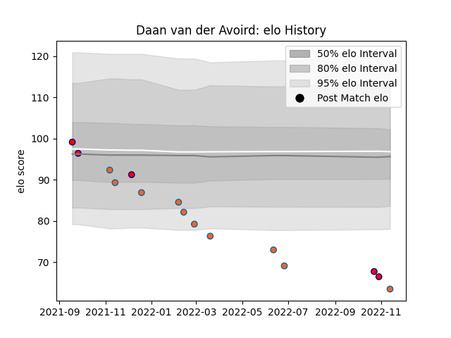

---  
layout: page  
title: Daan van der Avoird  
date: 2022-11-16 11:26:52.098041  
categories: player  
---
# Daan van der Avoird

## Positions: W

## Country: Netherlands

## Current elo: 63.0

## Current Percentile: 0.0

# Elo History

# Match History

| Team        |   Appearances |   Win Rate |
|:------------|--------------:|-----------:|
| Netherlands |            10 |        0   |
| Delta       |             5 |        0.2 |

| Opponent                 |   Matches |   Win Rate |
|:-------------------------|----------:|-----------:|
| Brussels Devils          |         2 |        0.5 |
| Castilla y Leon Iberians |         2 |        0   |
| Romania                  |         2 |        0   |
| Spain                    |         2 |        0   |
| Canada                   |         1 |        0   |
| Georgia                  |         1 |        0   |
| Italy                    |         1 |        0   |
| Lusitanos XV             |         1 |        0   |
| Portugal                 |         1 |        0   |
| Russia                   |         1 |        0   |
| Zimbabwe                 |         1 |        0   |