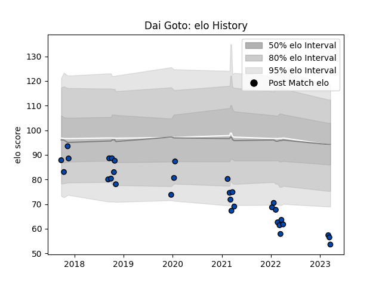

---  
layout: page  
title: Dai Goto  
date: 2023-03-21 18:51:04.292232  
categories: player  
---
# Dai Goto

Last updated: 2023-03-21
## Positions: SH

## Current elo: 54.0

## Current Percentile: 1.0

# Elo History

# Match History

| Team                |   Appearances |   Win Rate |
|:--------------------|--------------:|-----------:|
| Skyactivs Hiroshima |            17 |   0.176471 |
| Mazda Blue Zoomers  |            14 |   0.321429 |

| Opponent                         |   Matches |   Win Rate |
|:---------------------------------|----------:|-----------:|
| Kamaishi Seawaves                |         5 |       0.5  |
| Kyuden Voltex                    |         5 |       0.4  |
| Chugoku Red Regulions            |         4 |       0.75 |
| Hanazono Kintetsu Liners         |         3 |       0    |
| Mitsubishi Dynaboars             |         3 |       0    |
| NTT Docomo Red Hurricanes Osaka  |         3 |       0    |
| Hino Red Dolphins                |         2 |       0    |
| Kurita Water Gush                |         2 |       0    |
| Mie Honda Heat                   |         2 |       0    |
| Coca-Cola Red Sparks             |         1 |       0    |
| Toyota Industries Shuttles Aichi |         1 |       0    |