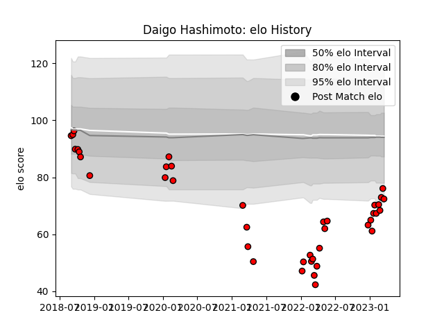

---  
layout: page  
title: Daigo Hashimoto  
date: 2023-03-17 17:20:10.735446  
categories: player  
---
# Daigo Hashimoto

## Positions: H

## Current elo: 76.0

## Current Percentile: 6.0

# Elo History

# Match History

| Team                      |   Appearances |   Win Rate |
|:--------------------------|--------------:|-----------:|
| Toshiba Brave Lupus Tokyo |            39 |   0.461538 |

| Opponent                          |   Matches |   Win Rate |
|:----------------------------------|----------:|-----------:|
| Tokyo Sungoliath                  |         6 |   0.333333 |
| Kubota Spears Funabashi Tokyo-Bay |         4 |   0        |
| Black Rams Tokyo                  |         3 |   0.666667 |
| Green Rockets Tokatsu             |         3 |   0.666667 |
| Kobelco Kobe Steelers             |         3 |   0.666667 |
| Saitama Wild Knights              |         3 |   0        |
| Shizuoka Blue Revs                |         3 |   0.666667 |
| Yokohama Canon Eagles             |         3 |   0.333333 |
| Mitsubishi Dynaboars              |         2 |   0.5      |
| NTT Docomo Red Hurricanes Osaka   |         2 |   1        |
| Toyota Verblitz                   |         2 |   1        |
| Urayasu D-Rocks                   |         2 |   0        |
| Coca-Cola Red Sparks              |         1 |   1        |
| Hanazono Kintetsu Liners          |         1 |   1        |
| Mie Honda Heat                    |         1 |   0        |