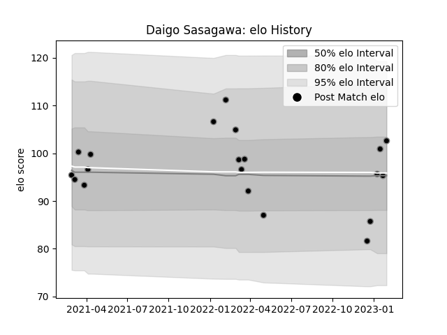

---  
layout: page  
title: Daigo Sasagawa  
date: 2023-01-13 11:31:55.044235  
categories: player  
---
# Daigo Sasagawa

## Positions: P

## Current elo: 96.0

## Current Percentile: 12.0

# Elo History

# Match History

| Team             |   Appearances |   Win Rate |
|:-----------------|--------------:|-----------:|
| Black Rams Tokyo |            17 |   0.352941 |

| Opponent                        |   Matches |   Win Rate |
|:--------------------------------|----------:|-----------:|
| Toyota Verblitz                 |         3 |   0.333333 |
| Green Rockets Tokatsu           |         2 |   1        |
| Kobelco Kobe Steelers           |         2 |   0        |
| NTT Docomo Red Hurricanes Osaka |         2 |   0.5      |
| Yokohama Canon Eagles           |         2 |   0        |
| Hino Red Dolphins               |         1 |   1        |
| Mitsubishi Dynaboars            |         1 |   0        |
| Saitama Wild Knights            |         1 |   0        |
| Shizuoka Blue Revs              |         1 |   1        |
| Toshiba Brave Lupus Tokyo       |         1 |   0        |
| Urayasu D-Rocks                 |         1 |   0        |