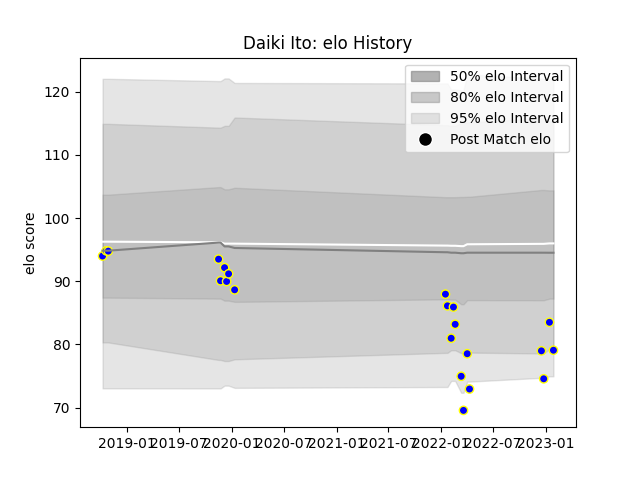

---  
layout: page  
title: Daiki Ito  
date: 2023-01-15 11:50:33.449266  
categories: player  
---
# Daiki Ito

## Positions: H

## Current elo: 83.0

## Current Percentile: 4.0

# Elo History

# Match History

| Team              |   Appearances |   Win Rate |
|:------------------|--------------:|-----------:|
| Kamaishi Seawaves |            21 |   0.261905 |

| Opponent                         |   Matches |   Win Rate |
|:---------------------------------|----------:|-----------:|
| Hanazono Kintetsu Liners         |         4 |        0   |
| Hino Red Dolphins                |         3 |        0   |
| Mie Honda Heat                   |         3 |        0   |
| Skyactivs Hiroshima              |         2 |        0.5 |
| Chugoku Red Regulions            |         1 |        1   |
| Coca-Cola Red Sparks             |         1 |        0.5 |
| Kurita Water Gush                |         1 |        1   |
| Kyuden Voltex                    |         1 |        0   |
| Mazda Blue Zoomers               |         1 |        1   |
| Mitsubishi Dynaboars             |         1 |        0   |
| NTT Docomo Red Hurricanes Osaka  |         1 |        0   |
| Shimizu Blue Sharks              |         1 |        1   |
| Toyota Industries Shuttles Aichi |         1 |        0   |