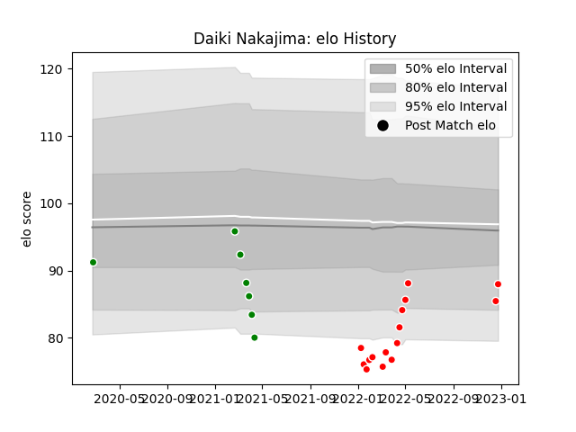

---  
layout: page  
title: Daiki Nakajima  
date: 2023-01-13 11:38:26.102230  
categories: player  
---
# Daiki Nakajima

## Positions: SH

## Current elo: 84.0

## Current Percentile: 26.0

# Elo History

# Match History

| Team                  |   Appearances |   Win Rate |
|:----------------------|--------------:|-----------:|
| Kobelco Kobe Steelers |            16 |        0.5 |
| Green Rockets Tokatsu |             7 |        0   |

| Opponent                          |   Matches |   Win Rate |
|:----------------------------------|----------:|-----------:|
| Yokohama Canon Eagles             |         4 |   0.25     |
| Black Rams Tokyo                  |         3 |   0.333333 |
| Green Rockets Tokatsu             |         3 |   1        |
| Saitama Wild Knights              |         3 |   0        |
| Kubota Spears Funabashi Tokyo-Bay |         2 |   0.5      |
| Urayasu D-Rocks                   |         2 |   0.5      |
| Hanazono Kintetsu Liners          |         1 |   1        |
| Hino Red Dolphins                 |         1 |   0        |
| Kobelco Kobe Steelers             |         1 |   0        |
| Shizuoka Blue Revs                |         1 |   0        |
| Tokyo Sungoliath                  |         1 |   0        |
| Toshiba Brave Lupus Tokyo         |         1 |   0        |