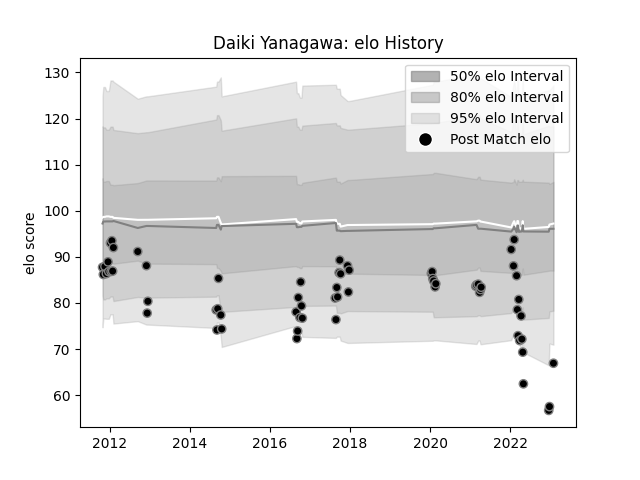

---  
layout: page  
title: Daiki Yanagawa  
date: 2023-02-02 19:09:13.397094  
categories: player  
---
# Daiki Yanagawa

## Positions: FL, L

## Current elo: 67.0

## Current Percentile: 1.0

# Elo History

# Match History

| Team             |   Appearances |   Win Rate |
|:-----------------|--------------:|-----------:|
| Black Rams Tokyo |            66 |   0.401515 |

| Opponent                          |   Matches |   Win Rate |
|:----------------------------------|----------:|-----------:|
| Tokyo Sungoliath                  |         6 |   0        |
| Shizuoka Blue Revs                |         6 |   0.166667 |
| Green Rockets Tokatsu             |         6 |   0.833333 |
| Yokohama Canon Eagles             |         5 |   0.4      |
| Urayasu D-Rocks                   |         5 |   0.3      |
| Kobelco Kobe Steelers             |         5 |   0.2      |
| Toyota Verblitz                   |         5 |   0.2      |
| Saitama Wild Knights              |         4 |   0        |
| Hanazono Kintetsu Liners          |         4 |   0.5      |
| Toshiba Brave Lupus Tokyo         |         4 |   0.25     |
| NTT Docomo Red Hurricanes Osaka   |         4 |   1        |
| Coca-Cola Red Sparks              |         3 |   1        |
| Munakata Sanix Blues              |         3 |   1        |
| Mitsubishi Dynaboars              |         1 |   0        |
| Mie Honda Heat                    |         1 |   0        |
| Kyuden Voltex                     |         1 |   0        |
| Toyota Industries Shuttles Aichi  |         1 |   1        |
| Kubota Spears Funabashi Tokyo-Bay |         1 |   0        |
| Hino Red Dolphins                 |         1 |   1        |