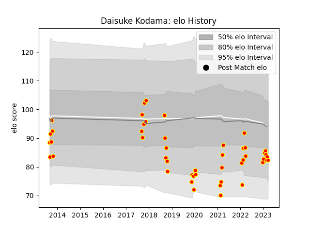

---  
layout: page  
title: Daisuke Kodama  
date: 2023-01-13 11:29:05.468306  
categories: player  
---
# Daisuke Kodama

## Positions: SH

## Current elo: 90.0

## Current Percentile: 40.0

# Elo History

# Match History

| Team          |   Appearances |   Win Rate |
|:--------------|--------------:|-----------:|
| Kyuden Voltex |            33 |   0.393939 |

| Opponent                         |   Matches |   Win Rate |
|:---------------------------------|----------:|-----------:|
| Chugoku Red Regulions            |         5 |   1        |
| Kamaishi Seawaves                |         3 |   0.666667 |
| Kurita Water Gush                |         3 |   0.333333 |
| Mazda Blue Zoomers               |         3 |   0.333333 |
| Shimizu Blue Sharks              |         3 |   0.666667 |
| Toyota Industries Shuttles Aichi |         3 |   0        |
| Coca-Cola Red Sparks             |         2 |   0        |
| Hanazono Kintetsu Liners         |         2 |   0        |
| Munakata Sanix Blues             |         2 |   0        |
| NTT Docomo Red Hurricanes Osaka  |         2 |   0        |
| Chubu Electric Power             |         1 |   1        |
| Hino Red Dolphins                |         1 |   0        |
| Mie Honda Heat                   |         1 |   0        |
| Mitsubishi Dynaboars             |         1 |   0        |
| Skyactivs Hiroshima              |         1 |   1        |