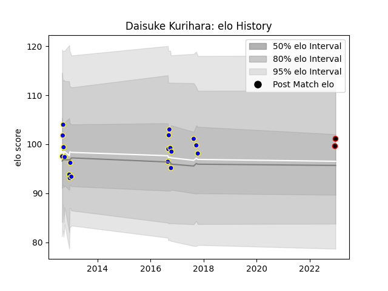

---  
layout: page  
title: Daisuke Kurihara  
date: 2022-12-31 16:28:38.069755  
categories: player  
---
# Daisuke Kurihara

## Positions: FL, N8

## Current elo: 102.0

## Current Percentile: 68.0

# Elo History

# Match History

| Team                            |   Appearances |   Win Rate |
|:--------------------------------|--------------:|-----------:|
| Urayasu D-Rocks                 |            19 |   0.578947 |
| NTT Docomo Red Hurricanes Osaka |             2 |   1        |

| Opponent                         |   Matches |   Win Rate |
|:---------------------------------|----------:|-----------:|
| Black Rams Tokyo                 |         3 |   0.666667 |
| Green Rockets Tokatsu            |         2 |   0.5      |
| Hanazono Kintetsu Liners         |         2 |   1        |
| Kyuden Voltex                    |         2 |   1        |
| Saitama Wild Knights             |         2 |   0.5      |
| Shizuoka Blue Revs               |         2 |   0        |
| Chugoku Red Regulions            |         1 |   1        |
| Coca-Cola Red Sparks             |         1 |   1        |
| Kobelco Kobe Steelers            |         1 |   0        |
| NTT Docomo Red Hurricanes Osaka  |         1 |   1        |
| Tokyo Sungoliath                 |         1 |   0        |
| Toshiba Brave Lupus Tokyo        |         1 |   0        |
| Toyota Industries Shuttles Aichi |         1 |   1        |
| Toyota Verblitz                  |         1 |   1        |