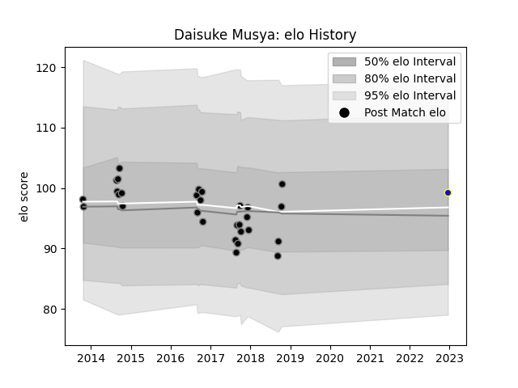

---  
layout: page  
title: Daisuke Musya  
date: 2023-02-15 22:14:07.182082  
categories: player  
---
# Daisuke Musya

## Positions: FL

## Current elo: 88.0

## Current Percentile: 33.0

# Elo History

# Match History

| Team                 |   Appearances |   Win Rate |
|:---------------------|--------------:|-----------:|
| Black Rams Tokyo     |            48 |     0.4375 |
| Kamaishi Seawaves    |             3 |     0      |
| Mitsubishi Dynaboars |             3 |     0      |

| Opponent                          |   Matches |   Win Rate |
|:----------------------------------|----------:|-----------:|
| Coca-Cola Red Sparks              |         4 |   1        |
| Hanazono Kintetsu Liners          |         4 |   0.5      |
| Urayasu D-Rocks                   |         4 |   0.25     |
| Kobelco Kobe Steelers             |         4 |   0.25     |
| Kubota Spears Funabashi Tokyo-Bay |         4 |   0        |
| Mie Honda Heat                    |         4 |   0.25     |
| Green Rockets Tokatsu             |         4 |   1        |
| Saitama Wild Knights              |         4 |   0.25     |
| Shizuoka Blue Revs                |         4 |   0        |
| Toshiba Brave Lupus Tokyo         |         3 |   0.333333 |
| Toyota Verblitz                   |         3 |   0        |
| Yokohama Canon Eagles             |         3 |   0.666667 |
| Tokyo Sungoliath                  |         3 |   0        |
| Toyota Industries Shuttles Aichi  |         2 |   0.5      |
| NTT Docomo Red Hurricanes Osaka   |         2 |   1        |
| Munakata Sanix Blues              |         1 |   1        |
| Hino Red Dolphins                 |         1 |   0        |