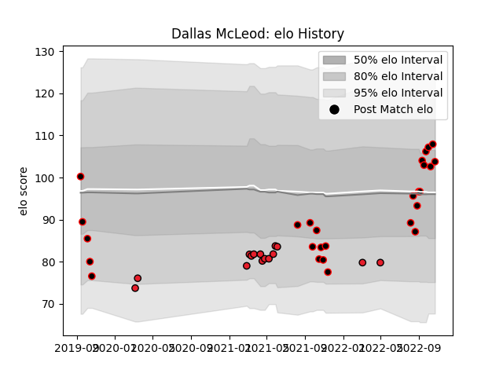

---  
layout: page  
title: Dallas McLeod  
date: 2023-03-21 18:28:21.494004  
categories: player  
---
# Dallas McLeod

Last updated: 2023-03-21
## Positions: C, W

## Current elo: 105.0

## Current Percentile: 70.0

# Elo History

# Match History

| Team       |   Appearances |   Win Rate |
|:-----------|--------------:|-----------:|
| Canterbury |            27 |   0.666667 |
| Crusaders  |            17 |   0.823529 |

| Opponent                 |   Matches |   Win Rate |
|:-------------------------|----------:|-----------:|
| Wellington               |         4 |   0.25     |
| Blues                    |         3 |   1        |
| Chiefs                   |         3 |   0.666667 |
| Otago                    |         3 |   0.666667 |
| Northland                |         3 |   1        |
| Auckland                 |         2 |   0.5      |
| Bay of Plenty            |         2 |   1        |
| Waikato                  |         2 |   0.5      |
| Tasman                   |         2 |   1        |
| Queensland Reds          |         2 |   1        |
| North Harbour            |         2 |   1        |
| New South Wales Waratahs |         2 |   0.5      |
| Manawatu                 |         2 |   0.5      |
| Hurricanes               |         2 |   1        |
| Hawke's Bay              |         2 |   0.5      |
| Moana Pasifika           |         1 |   1        |
| Highlanders              |         1 |   1        |
| Southland                |         1 |   1        |
| Sunwolves                |         1 |   1        |
| Taranaki                 |         1 |   0        |
| Fijian Drua              |         1 |   0        |
| Counties Manukau         |         1 |   1        |
| Western Force            |         1 |   1        |