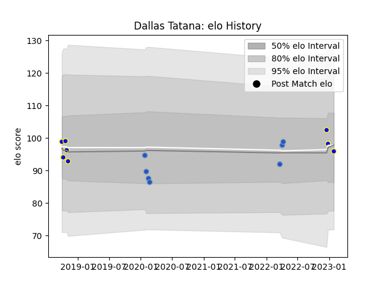

---  
layout: page  
title: Dallas Tatana  
date: 2022-12-18 16:33:36.594961  
categories: player  
---
# Dallas Tatana

## Positions: L

## Current elo: 87.0

## Current Percentile: 23.0

# Elo History

# Match History

| Team                 |   Appearances |   Win Rate |
|:---------------------|--------------:|-----------:|
| Kamaishi Seawaves    |             5 |        0.2 |
| Munakata Sanix Blues |             2 |        1   |

| Opponent                        |   Matches |   Win Rate |
|:--------------------------------|----------:|-----------:|
| Chugoku Red Regulions           |         1 |          1 |
| Hanazono Kintetsu Liners        |         1 |          0 |
| Hino Red Dolphins               |         1 |          0 |
| Kurita Water Gush               |         1 |          0 |
| Kyuden Voltex                   |         1 |          1 |
| NTT Docomo Red Hurricanes Osaka |         1 |          0 |
| Shimizu Blue Sharks             |         1 |          1 |