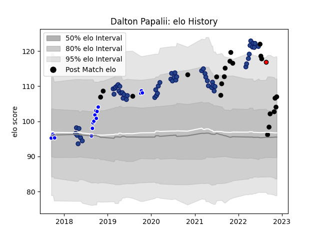

---  
layout: page  
title: Dalton Papalii  
date: 2023-03-12 11:32:29.147145  
categories: player  
---
# Dalton Papalii

## Positions: FL

## Country: New Zealand

## Current elo: 103.0

## Current Percentile: 96.0

# Elo History

# Match History

| Team             |   Appearances |   Win Rate |
|:-----------------|--------------:|-----------:|
| Blues            |            56 |   0.607143 |
| New Zealand      |            22 |   0.818182 |
| Auckland         |            16 |   0.75     |
| Counties Manukau |             1 |   0        |

| Opponent                 |   Matches |   Win Rate |
|:-------------------------|----------:|-----------:|
| Highlanders              |        10 |   0.7      |
| Chiefs                   |         9 |   0.555556 |
| Crusaders                |         7 |   0.142857 |
| Hurricanes               |         6 |   0.5      |
| Australia                |         6 |   1        |
| Ireland                  |         4 |   0.25     |
| New South Wales Waratahs |         4 |   1        |
| Tasman                   |         3 |   0.333333 |
| Brumbies                 |         3 |   0.666667 |
| Queensland Reds          |         3 |   0.666667 |
| Waikato                  |         2 |   0.5      |
| Taranaki                 |         2 |   1        |
| Melbourne Rebels         |         2 |   0.5      |
| Sunwolves                |         2 |   1        |
| Wales                    |         2 |   1        |
| Stormers                 |         2 |   1        |
| Southland                |         2 |   1        |
| Argentina                |         2 |   1        |
| Western Force            |         2 |   1        |
| Japan                    |         2 |   1        |
| Canterbury               |         2 |   0.5      |
| Jaguares                 |         2 |   0        |
| England                  |         1 |   0.5      |
| Wellington               |         1 |   1        |
| Bay of Plenty            |         1 |   1        |
| Bulls                    |         1 |   1        |
| United States of America |         1 |   1        |
| Tonga                    |         1 |   1        |
| Counties Manukau         |         1 |   1        |
| Moana Pasifika           |         1 |   1        |
| Lions                    |         1 |   1        |
| South Africa             |         1 |   0.5      |
| Sharks                   |         1 |   0        |
| Scotland                 |         1 |   1        |
| Otago                    |         1 |   0        |
| Northland                |         1 |   1        |
| North Harbour            |         1 |   1        |
| Italy                    |         1 |   1        |