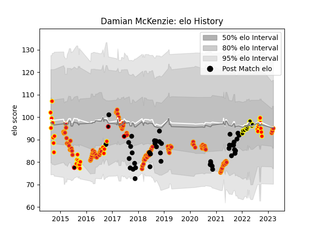

---  
layout: page  
title: Damian McKenzie  
date: 2023-02-24 09:53:52.577345  
categories: player  
---
# Damian McKenzie

## Positions: FB, FH

## Country: New Zealand

## Current elo: 91.0

## Current Percentile: 41.0

# Elo History

# Match History

| Team              |   Appearances |   Win Rate |
|:------------------|--------------:|-----------:|
| Chiefs            |            95 |   0.6      |
| New Zealand       |            42 |   0.821429 |
| Waikato           |            34 |   0.544118 |
| Tokyo Sungoliath  |            14 |   0.785714 |
| New Zealand Maori |             3 |   0.666667 |

| Opponent                          |   Matches |   Win Rate |
|:----------------------------------|----------:|-----------:|
| Crusaders                         |        14 |   0.357143 |
| Australia                         |        14 |   0.821429 |
| Hurricanes                        |        14 |   0.392857 |
| Highlanders                       |        12 |   0.333333 |
| Blues                             |        11 |   0.772727 |
| Argentina                         |         7 |   0.857143 |
| Brumbies                          |         7 |   0.714286 |
| Queensland Reds                   |         5 |   0.8      |
| France                            |         5 |   0.8      |
| South Africa                      |         5 |   0.6      |
| Stormers                          |         5 |   0.8      |
| Auckland                          |         4 |   0.5      |
| Sunwolves                         |         4 |   0.75     |
| Manawatu                          |         4 |   0.75     |
| Bulls                             |         4 |   1        |
| Wellington                        |         4 |   0.5      |
| Western Force                     |         4 |   1        |
| Bay of Plenty                     |         4 |   0.75     |
| Toshiba Brave Lupus Tokyo         |         3 |   0.666667 |
| New South Wales Waratahs          |         3 |   0.666667 |
| Tasman                            |         3 |   0        |
| Melbourne Rebels                  |         3 |   0.666667 |
| Fiji                              |         3 |   1        |
| Jaguares                          |         3 |   0.666667 |
| Italy                             |         3 |   1        |
| Counties Manukau                  |         3 |   0.666667 |
| NTT Docomo Red Hurricanes Osaka   |         2 |   1        |
| Otago                             |         2 |   0        |
| Taranaki                          |         2 |   0.5      |
| Saitama Wild Knights              |         2 |   0        |
| United States of America          |         2 |   1        |
| Sharks                            |         2 |   0.5      |
| Canterbury                        |         2 |   0        |
| Southland                         |         2 |   1        |
| Cheetahs                          |         2 |   1        |
| Hawke's Bay                       |         2 |   0.75     |
| Black Rams Tokyo                  |         1 |   1        |
| British and Irish Lions           |         1 |   0        |
| Wales                             |         1 |   1        |
| Urayasu D-Rocks                   |         1 |   1        |
| Toyota Verblitz                   |         1 |   1        |
| Tonga                             |         1 |   1        |
| Kobelco Kobe Steelers             |         1 |   1        |
| England                           |         1 |   1        |
| Southern Kings                    |         1 |   1        |
| Kubota Spears Funabashi Tokyo-Bay |         1 |   1        |
| Shizuoka Blue Revs                |         1 |   1        |
| Scotland                          |         1 |   1        |
| Northland                         |         1 |   1        |
| North Harbour                     |         1 |   1        |
| Ireland                           |         1 |   0        |
| Lions                             |         1 |   0        |
| Yokohama Canon Eagles             |         1 |   1        |