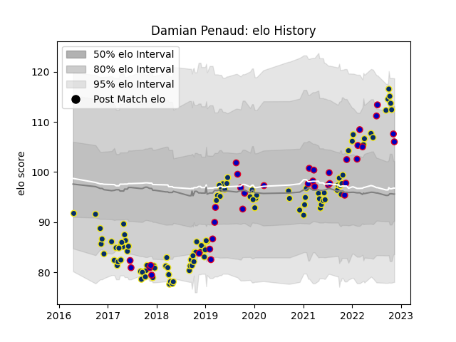

---  
layout: page  
title: Damian Penaud  
date: 2022-11-16 11:26:10.088053  
categories: player  
---
# Damian Penaud

## Positions: W, C

## Country: France

## Current elo: 106.0

## Current Percentile: 84.0

# Elo History

# Match History

| Team              |   Appearances |   Win Rate |
|:------------------|--------------:|-----------:|
| Clermont Auvergne |           103 |   0.650485 |
| France            |            36 |   0.569444 |

| Opponent             |   Matches |   Win Rate |
|:---------------------|----------:|-----------:|
| Racing 92            |        10 |   0.3      |
| Stade Toulousain     |         9 |   0.277778 |
| Toulon               |         8 |   0.625    |
| La Rochelle          |         8 |   0.75     |
| Pau                  |         7 |   0.857143 |
| Lyon                 |         6 |   0.833333 |
| Scotland             |         6 |   0.5      |
| Montpellier Herault  |         6 |   0.5      |
| Bordeaux Begles      |         6 |   0.416667 |
| Agen                 |         5 |   0.8      |
| South Africa         |         5 |   0.2      |
| Brive                |         5 |   0.8      |
| Castres Olympique    |         5 |   0.6      |
| Stade Francais Paris |         4 |   0.5      |
| Northampton Saints   |         4 |   1        |
| Australia            |         4 |   0.5      |
| Saracens             |         3 |   0.666667 |
| Wales                |         3 |   0.333333 |
| Italy                |         3 |   1        |
| Ireland              |         3 |   0.666667 |
| Japan                |         3 |   0.833333 |
| England              |         3 |   0.333333 |
| Bayonne              |         3 |   0.333333 |
| Argentina            |         2 |   1        |
| New Zealand          |         2 |   0.5      |
| Harlequins           |         2 |   1        |
| Perpignan            |         2 |   1        |
| Grenoble             |         2 |   1        |
| Biarritz Olympique   |         2 |   1        |
| Tonga                |         1 |   1        |
| Ulster               |         1 |   1        |
| Bath Rugby           |         1 |   1        |
| Georgia              |         1 |   1        |
| Timisoara Saracens   |         1 |   1        |
| Dragons              |         1 |   1        |
| Ospreys              |         1 |   1        |
| Leinster             |         1 |   1        |