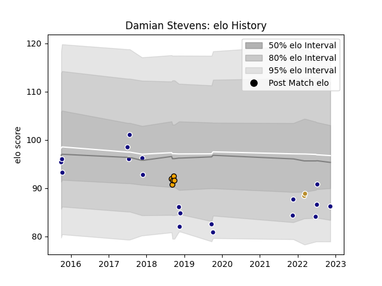

---  
layout: page  
title: Damian Stevens  
date: 2022-11-16 11:32:06.003179  
categories: player  
---
# Damian Stevens

## Positions: SH

## Country: Namibia

## Current elo: 85.0

## Current Percentile: 21.0

# Elo History

# Match History

| Team             |   Appearances |   Win Rate |
|:-----------------|--------------:|-----------:|
| Namibia          |            19 |   0.421053 |
| NOLA Gold        |            12 |   0.166667 |
| Boland Cavaliers |             5 |   0.4      |

| Opponent               |   Matches |   Win Rate |
|:-----------------------|----------:|-----------:|
| Zimbabwe               |         3 |          1 |
| New England Free Jacks |         3 |          0 |
| Rugby ATL              |         3 |          0 |
| Uruguay                |         2 |          0 |
| Spain                  |         2 |          0 |
| Old Glory DC           |         2 |          1 |
| R.U. New York          |         2 |          0 |
| Italy                  |         2 |          0 |
| Kenya                  |         2 |          1 |
| Leopards               |         1 |          0 |
| Tonga                  |         1 |          0 |
| Valke                  |         1 |          1 |
| Border Bulldogs        |         1 |          0 |
| Uganda                 |         1 |          1 |
| Tunisia                |         1 |          1 |
| Toronto Arrows         |         1 |          0 |
| SWD Eagles             |         1 |          0 |
| Georgia                |         1 |          0 |
| Russia                 |         1 |          0 |
| Griffons               |         1 |          1 |
| Austin Gilgronis       |         1 |          0 |
| Portugal               |         1 |          1 |
| New Zealand            |         1 |          0 |
| Argentina              |         1 |          0 |