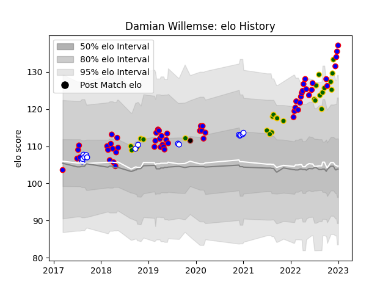

---  
layout: page  
title: Damian Willemse  
date: 2022-12-31 16:29:32.984519  
categories: player  
---
# Damian Willemse

## Positions: FH, FB

## Country: South Africa

## Current elo: 128.0

## Current Percentile: 98.0

# Elo History

# Match History

| Team             |   Appearances |   Win Rate |
|:-----------------|--------------:|-----------:|
| Stormers         |            56 |   0.660714 |
| South Africa     |            28 |   0.571429 |
| Western Province |            16 |   0.5625   |
| Saracens         |             1 |   0        |

| Opponent                 |   Matches |   Win Rate |
|:-------------------------|----------:|-----------:|
| Bulls                    |        10 |   0.8      |
| Argentina                |         5 |   0.8      |
| Sharks                   |         5 |   0.5      |
| Australia                |         5 |   0.4      |
| Lions                    |         5 |   0.6      |
| Wales                    |         5 |   0.6      |
| Jaguares                 |         4 |   0.75     |
| Griquas                  |         4 |   0.5      |
| Pumas                    |         3 |   0.666667 |
| New Zealand              |         3 |   0.333333 |
| British and Irish Lions  |         3 |   0.666667 |
| Blues                    |         3 |   0.333333 |
| Blue Bulls               |         3 |   0.666667 |
| Free State Cheetahs      |         3 |   0.666667 |
| Ulster                   |         2 |   1        |
| Golden Lions             |         2 |   0.5      |
| Melbourne Rebels         |         2 |   1        |
| Hurricanes               |         2 |   0.5      |
| Queensland Reds          |         2 |   0.5      |
| Highlanders              |         2 |   0.5      |
| Zebre                    |         2 |   1        |
| England                  |         2 |   0.5      |
| Chiefs                   |         2 |   0        |
| Clermont Auvergne        |         1 |   0        |
| Brumbies                 |         1 |   0        |
| Canada                   |         1 |   1        |
| Sunwolves                |         1 |   1        |
| Southern Kings           |         1 |   1        |
| Cardiff Blues            |         1 |   1        |
| Scarlets                 |         1 |   1        |
| Racing 92                |         1 |   0        |
| Cheetahs                 |         1 |   1        |
| Ospreys                  |         1 |   1        |
| Glasgow Warriors         |         1 |   1        |
| Georgia                  |         1 |   1        |
| Natal Sharks             |         1 |   0        |
| Connacht                 |         1 |   0        |
| London Irish             |         1 |   1        |
| Crusaders                |         1 |   0.5      |
| Leinster                 |         1 |   1        |
| Edinburgh                |         1 |   1        |
| Italy                    |         1 |   1        |
| Ireland                  |         1 |   0        |
| France                   |         1 |   0        |
| New South Wales Waratahs |         1 |   0        |