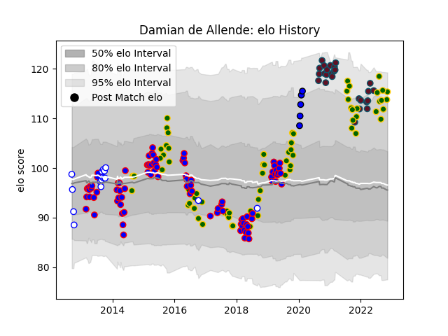

---  
layout: page  
title: Damian de Allende  
date: 2023-03-17 17:31:52.485664  
categories: player  
---
# Damian de Allende

## Positions: C

## Country: South Africa

## Current elo: 123.0

## Current Percentile: 92.0

# Elo History

# Match History

| Team                     |   Appearances |   Win Rate |
|:-------------------------|--------------:|-----------:|
| Stormers                 |            91 |   0.532967 |
| South Africa             |            77 |   0.590909 |
| Munster                  |            34 |   0.602941 |
| Western Province         |            22 |   0.772727 |
| Saitama Wild Knights     |             6 |   1        |
| Hanazono Kintetsu Liners |             4 |   0.75     |

| Opponent                          |   Matches |   Win Rate |
|:----------------------------------|----------:|-----------:|
| New Zealand                       |        15 |   0.233333 |
| Argentina                         |        14 |   0.857143 |
| Bulls                             |        13 |   0.538462 |
| Lions                             |        10 |   0.35     |
| Australia                         |         9 |   0.222222 |
| Sharks                            |         9 |   0.555556 |
| Wales                             |         8 |   0.75     |
| Cheetahs                          |         7 |   0.571429 |
| England                           |         7 |   0.571429 |
| Chiefs                            |         6 |   0.166667 |
| Leinster                          |         6 |   0        |
| Blues                             |         5 |   0.6      |
| Ireland                           |         5 |   0.4      |
| Natal Sharks                      |         5 |   0.6      |
| Queensland Reds                   |         5 |   0.6      |
| Golden Lions                      |         4 |   0.625    |
| Griquas                           |         4 |   1        |
| Melbourne Rebels                  |         4 |   1        |
| Blue Bulls                        |         4 |   0.625    |
| Jaguares                          |         4 |   0.5      |
| Hurricanes                        |         4 |   0.5      |
| Highlanders                       |         4 |   0.5      |
| New South Wales Waratahs          |         4 |   0.25     |
| Scotland                          |         4 |   1        |
| Crusaders                         |         4 |   0.125    |
| Connacht                          |         4 |   0.75     |
| Brumbies                          |         4 |   0.5      |
| Sunwolves                         |         4 |   0.625    |
| Free State Cheetahs               |         3 |   1        |
| France                            |         3 |   0.666667 |
| British and Irish Lions           |         3 |   0.666667 |
| Southern Kings                    |         3 |   1        |
| Italy                             |         3 |   0.666667 |
| Western Force                     |         3 |   1        |
| Scarlets                          |         2 |   1        |
| Toshiba Brave Lupus Tokyo         |         2 |   1        |
| Ospreys                           |         2 |   0.5      |
| Stade Toulousain                  |         2 |   0.25     |
| Ulster                            |         2 |   0.5      |
| Japan                             |         2 |   1        |
| Kubota Spears Funabashi Tokyo-Bay |         2 |   1        |
| Benetton Treviso                  |         2 |   1        |
| Exeter Chiefs                     |         2 |   0.5      |
| Cardiff Blues                     |         2 |   1        |
| Namibia                           |         1 |   1        |
| Castres Olympique                 |         1 |   1        |
| Yokohama Canon Eagles             |         1 |   1        |
| Wasps                             |         1 |   1        |
| Boland Cavaliers                  |         1 |   1        |
| United States of America          |         1 |   1        |
| Canada                            |         1 |   1        |
| Toyota Verblitz                   |         1 |   1        |
| Tokyo Sungoliath                  |         1 |   1        |
| Clermont Auvergne                 |         1 |   1        |
| Mitsubishi Dynaboars              |         1 |   1        |
| Dragons                           |         1 |   1        |
| Edinburgh                         |         1 |   1        |
| Glasgow Warriors                  |         1 |   1        |
| Samoa                             |         1 |   1        |
| Saitama Wild Knights              |         1 |   0        |
| Harlequins                        |         1 |   1        |
| Pumas                             |         1 |   1        |
| Mie Honda Heat                    |         1 |   1        |
| Zebre                             |         1 |   1        |