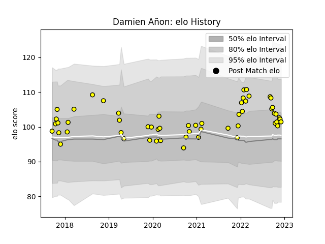

---  
layout: page  
title: Damien Añon  
date: 2022-11-22 11:26:39.048108  
categories: player  
---
# Damien Añon

## Positions: SH

## Current elo: 103.0

## Current Percentile: 72.0

# Elo History

# Match History

| Team        |   Appearances |   Win Rate |
|:------------|--------------:|-----------:|
| Carcassonne |            53 |   0.443396 |

| Opponent           |   Matches |   Win Rate |
|:-------------------|----------:|-----------:|
| Montauban          |         6 |   0.833333 |
| Mont-de-Marsan     |         5 |   0.6      |
| Soyaux-Angouleme   |         5 |   0.5      |
| Oyonnax            |         4 |   0        |
| Rouen              |         3 |   1        |
| Nevers             |         3 |   0.333333 |
| Aurillac           |         3 |   0.666667 |
| Vannes             |         3 |   0.333333 |
| Beziers            |         3 |   0.666667 |
| Massy              |         2 |   0        |
| Grenoble           |         2 |   0        |
| Colomiers          |         2 |   0        |
| Narbonne           |         2 |   1        |
| Biarritz Olympique |         2 |   0        |
| Perpignan          |         2 |   0        |
| Provence Rugby     |         2 |   0        |
| Brive              |         1 |   0        |
| Bayonne            |         1 |   1        |
| US Bressane        |         1 |   1        |
| Agen               |         1 |   0        |