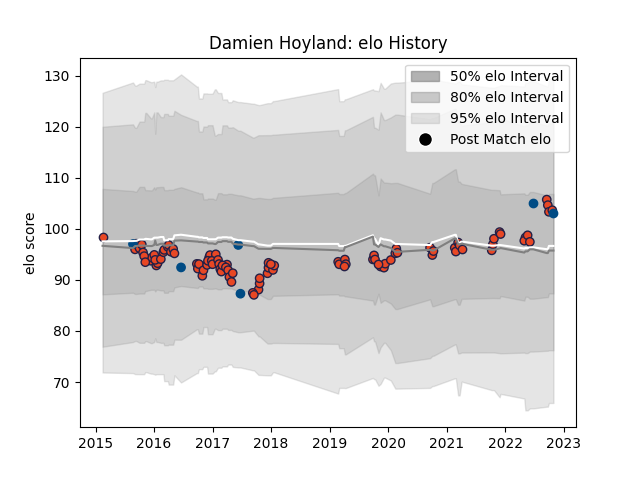

---  
layout: page  
title: Damien Hoyland  
date: 2023-02-24 02:28:30.933520  
categories: player  
---
# Damien Hoyland

## Positions: W, FB

## Country: Scotland

## Current elo: 103.0

## Current Percentile: 69.0

# Elo History

# Match History

| Team      |   Appearances |   Win Rate |
|:----------|--------------:|-----------:|
| Edinburgh |            96 |   0.505208 |
| Scotland  |             6 |   0.666667 |

| Opponent               |   Matches |   Win Rate |
|:-----------------------|----------:|-----------:|
| Benetton Treviso       |         8 |   0.5      |
| Zebre                  |         7 |   0.714286 |
| Munster                |         7 |   0        |
| Cardiff Blues          |         6 |   0.333333 |
| Connacht               |         6 |   0.333333 |
| Dragons                |         6 |   0.833333 |
| Scarlets               |         6 |   0.5      |
| Ulster                 |         5 |   0.4      |
| Glasgow Warriors       |         5 |   0.6      |
| Ospreys                |         5 |   0.4      |
| Leinster               |         4 |   0.25     |
| Stade Francais Paris   |         4 |   0.5      |
| London Irish           |         4 |   0.75     |
| Wasps                  |         3 |   0.666667 |
| Stormers               |         3 |   0.166667 |
| Agen                   |         3 |   1        |
| Krasny Yar Krasnoyarsk |         2 |   1        |
| Italy                  |         2 |   1        |
| Harlequins             |         2 |   1        |
| Grenoble               |         2 |   0.5      |
| Bulls                  |         2 |   0.5      |
| Krasny Yar             |         2 |   1        |
| La Rochelle            |         1 |   0        |
| Australia              |         1 |   0        |
| Japan                  |         1 |   1        |
| Racing 92              |         1 |   0        |
| Fiji                   |         1 |   0        |
| Chile                  |         1 |   1        |
| Timisoara Saracens     |         1 |   1        |
| Bordeaux Begles        |         1 |   0        |