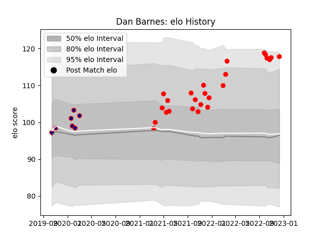

---  
layout: page  
title: Dan Barnes  
date: 2023-03-21 18:39:35.672494  
categories: player  
---
# Dan Barnes

Last updated: 2023-03-21
## Positions: C

## Current elo: 137.0

## Current Percentile: 99.0

# Elo History

# Match History

| Team            |   Appearances |   Win Rate |
|:----------------|--------------:|-----------:|
| Jersey          |            33 |   0.772727 |
| London Scottish |            11 |   0.227273 |

| Opponent            |   Matches |   Win Rate |
|:--------------------|----------:|-----------:|
| Cornish Pirates     |         5 |   0.8      |
| Nottingham          |         5 |   0.6      |
| Ampthill            |         4 |   0.5      |
| Coventry            |         4 |   0.5      |
| Hartpury College    |         4 |   1        |
| London Scottish     |         4 |   1        |
| Bedford             |         3 |   0.666667 |
| Caldy               |         3 |   1        |
| Doncaster           |         3 |   0.333333 |
| Ealing Trailfinders |         3 |   0        |
| Richmond            |         2 |   0.5      |
| Yorkshire Carnegie  |         2 |   1        |
| Newcastle Falcons   |         1 |   0        |
| Saracens            |         1 |   0        |