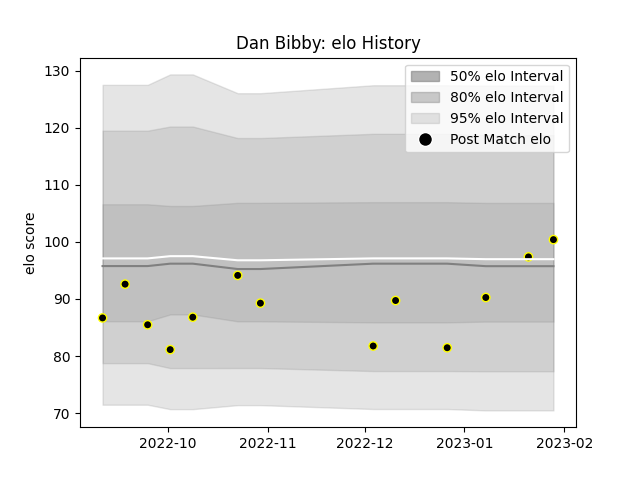

---  
layout: page  
title: Dan Bibby  
date: 2023-02-02 19:09:40.488189  
categories: player  
---
# Dan Bibby

## Positions: C, W

## Current elo: 100.0

## Current Percentile: 53.0

# Elo History

# Match History

| Team   |   Appearances |   Win Rate |
|:-------|--------------:|-----------:|
| Caldy  |            13 |   0.384615 |

| Opponent            |   Matches |   Win Rate |
|:--------------------|----------:|-----------:|
| Bedford             |         2 |        0.5 |
| Nottingham          |         2 |        0.5 |
| Ampthill            |         1 |        0   |
| Cornish Pirates     |         1 |        1   |
| Coventry            |         1 |        0   |
| Doncaster           |         1 |        0   |
| Ealing Trailfinders |         1 |        1   |
| Hartpury College    |         1 |        0   |
| Jersey              |         1 |        0   |
| London Scottish     |         1 |        0   |
| Richmond            |         1 |        1   |