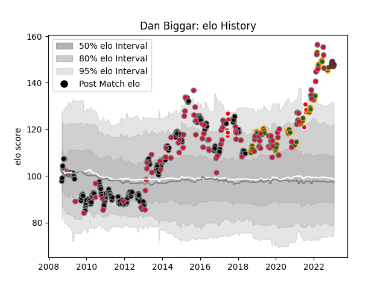

---  
layout: page  
title: Dan Biggar  
date: 2023-01-06 00:15:12.946915  
categories: player  
---
# Dan Biggar

## Positions: FH

## Country: Wales

## Current elo: 158.0

## Current Percentile: 100.0

# Elo History

# Match History

| Team                    |   Appearances |   Win Rate |
|:------------------------|--------------:|-----------:|
| Ospreys                 |           225 |   0.608889 |
| Wales                   |            99 |   0.535354 |
| Northampton Saints      |            64 |   0.484375 |
| British and Irish Lions |             9 |   0.5      |
| Toulon                  |             4 |   0.75     |

| Opponent             |   Matches |   Win Rate |
|:---------------------|----------:|-----------:|
| Leinster             |        21 |   0.357143 |
| Benetton Treviso     |        21 |   0.833333 |
| Scarlets             |        20 |   0.675    |
| Dragons              |        20 |   0.8      |
| Munster              |        17 |   0.411765 |
| Cardiff Blues        |        17 |   0.852941 |
| Ulster               |        15 |   0.4      |
| South Africa         |        15 |   0.4      |
| Leicester Tigers     |        13 |   0.384615 |
| England              |        13 |   0.384615 |
| Glasgow Warriors     |        12 |   0.5      |
| France               |        12 |   0.583333 |
| Connacht             |        11 |   1        |
| Edinburgh            |        11 |   0.636364 |
| Ireland              |        11 |   0.5      |
| Australia            |        10 |   0.3      |
| Italy                |         9 |   0.888889 |
| Clermont Auvergne    |         9 |   0.222222 |
| Scotland             |         9 |   0.777778 |
| New Zealand          |         8 |   0        |
| Exeter Chiefs        |         8 |   0.25     |
| Saracens             |         8 |   0.0625   |
| Zebre                |         8 |   0.875    |
| Gloucester Rugby     |         7 |   0.285714 |
| Wasps                |         7 |   0.571429 |
| Worcester Warriors   |         7 |   0.857143 |
| London Irish         |         6 |   0.666667 |
| Newcastle Falcons    |         5 |   0.8      |
| Northampton Saints   |         5 |   0.2      |
| Harlequins           |         5 |   0.6      |
| Lyon                 |         4 |   1        |
| Aironi               |         4 |   1        |
| Fiji                 |         4 |   0.875    |
| Bath Rugby           |         4 |   0.5      |
| Sale Sharks          |         3 |   0.333333 |
| Biarritz Olympique   |         3 |   0.333333 |
| Bristol Rugby        |         3 |   1        |
| Japan                |         3 |   0.666667 |
| Perpignan            |         2 |   0.5      |
| Toulon               |         2 |   0.5      |
| Bordeaux Begles      |         2 |   0.5      |
| Samoa                |         2 |   0.5      |
| Racing 92            |         2 |   0.25     |
| Canada               |         2 |   1        |
| Stade Toulousain     |         2 |   0.5      |
| Castres Olympique    |         2 |   0.5      |
| Arix Viadana         |         2 |   1        |
| Georgia              |         2 |   1        |
| Grenoble             |         2 |   1        |
| Argentina            |         2 |   1        |
| Bayonne              |         1 |   0        |
| Tonga                |         1 |   1        |
| Hurricanes           |         1 |   0.5      |
| Stade Francais Paris |         1 |   0        |
| Blues                |         1 |   0        |
| New Zealand Maori    |         1 |   1        |
| Cheetahs             |         1 |   0        |
| Chiefs               |         1 |   1        |
| Highlanders          |         1 |   0        |