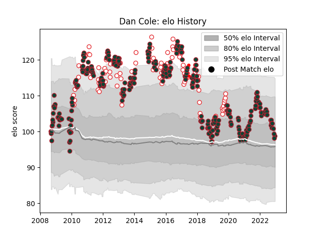

---  
layout: page  
title: Dan Cole  
date: 2022-12-12 14:50:23.548981  
categories: player  
---
# Dan Cole

## Positions: P

## Country: England

## Current elo: 98.0

## Current Percentile: 65.0

# Elo History

# Match History

| Team                    |   Appearances |   Win Rate |
|:------------------------|--------------:|-----------:|
| Leicester Tigers        |           293 |   0.624573 |
| England                 |            91 |   0.708791 |
| British and Irish Lions |             5 |   0.5      |

| Opponent                 |   Matches |   Win Rate |
|:-------------------------|----------:|-----------:|
| Northampton Saints       |        25 |   0.7      |
| Bath Rugby               |        25 |   0.5      |
| Wasps                    |        22 |   0.545455 |
| Saracens                 |        21 |   0.380952 |
| Sale Sharks              |        20 |   0.6      |
| Harlequins               |        18 |   0.638889 |
| London Irish             |        17 |   0.911765 |
| Exeter Chiefs            |        17 |   0.470588 |
| Worcester Warriors       |        17 |   0.882353 |
| Gloucester Rugby         |        16 |   0.78125  |
| Newcastle Falcons        |        15 |   0.866667 |
| Wales                    |        12 |   0.666667 |
| Australia                |        12 |   0.75     |
| France                   |        12 |   0.583333 |
| Scotland                 |        11 |   0.818182 |
| Italy                    |        10 |   1        |
| Ireland                  |        10 |   0.5      |
| Bristol Rugby            |         9 |   0.5      |
| Benetton Treviso         |         9 |   1        |
| Racing 92                |         7 |   0.142857 |
| South Africa             |         7 |   0.214286 |
| Ulster                   |         6 |   0.166667 |
| Munster                  |         4 |   0.5      |
| Perpignan                |         4 |   0.375    |
| Clermont Auvergne        |         4 |   0.5      |
| Ospreys                  |         4 |   0.625    |
| Argentina                |         4 |   1        |
| Toulon                   |         4 |   0.25     |
| New Zealand              |         4 |   0.5      |
| Scarlets                 |         3 |   1        |
| Stade Francais Paris     |         3 |   0.666667 |
| Yorkshire Carnegie       |         3 |   0.666667 |
| Fiji                     |         3 |   1        |
| Montpellier Herault      |         2 |   1        |
| Glasgow Warriors         |         2 |   0        |
| Stade Toulousain         |         2 |   0.5      |
| London Welsh             |         2 |   1        |
| Aironi                   |         2 |   1        |
| Pau                      |         2 |   0.5      |
| Leeds                    |         2 |   1        |
| Highlanders              |         1 |   0        |
| Castres Olympique        |         1 |   1        |
| Arix Viadana             |         1 |   1        |
| Blues                    |         1 |   0        |
| Calvisano                |         1 |   1        |
| Uruguay                  |         1 |   1        |
| United States of America |         1 |   1        |
| Cardiff Blues            |         1 |   0        |
| Leinster                 |         1 |   0        |
| Tonga                    |         1 |   1        |
| Romania                  |         1 |   1        |
| Chiefs                   |         1 |   1        |
| Crusaders                |         1 |   1        |
| Georgia                  |         1 |   1        |
| Samoa                    |         1 |   1        |
| Hurricanes               |         1 |   0.5      |
| Dragons                  |         1 |   1        |