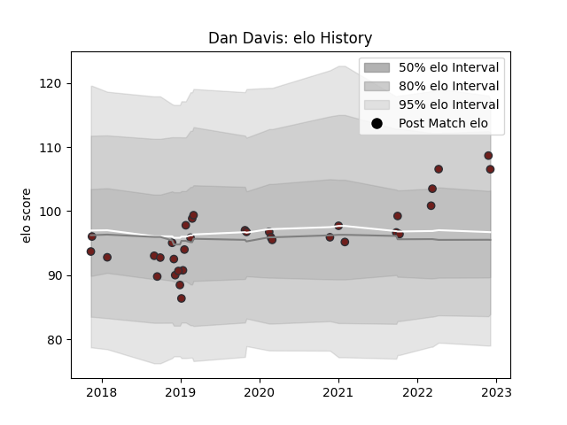

---  
layout: page  
title: Dan Davis  
date: 2023-01-06 00:15:23.407022  
categories: player  
---
# Dan Davis

## Positions: FL

## Current elo: 118.0

## Current Percentile: 84.0

# Elo History

# Match History

| Team     |   Appearances |   Win Rate |
|:---------|--------------:|-----------:|
| Scarlets |            37 |   0.432432 |

| Opponent         |   Matches |   Win Rate |
|:-----------------|----------:|-----------:|
| Ulster           |         4 |   0.25     |
| Dragons          |         4 |   0.75     |
| Edinburgh        |         3 |   0        |
| Munster          |         3 |   0.333333 |
| Benetton Treviso |         2 |   0.5      |
| Cardiff Blues    |         2 |   0.5      |
| Southern Kings   |         2 |   1        |
| Lions            |         2 |   0.5      |
| Leinster         |         2 |   0        |
| Glasgow Warriors |         2 |   0.5      |
| Cheetahs         |         2 |   1        |
| Leicester Tigers |         1 |   1        |
| Harlequins       |         1 |   0        |
| Exeter Chiefs    |         1 |   0        |
| Ospreys          |         1 |   0        |
| Racing 92        |         1 |   0        |
| Sharks           |         1 |   0        |
| Connacht         |         1 |   1        |
| Stormers         |         1 |   0        |
| Zebre            |         1 |   1        |