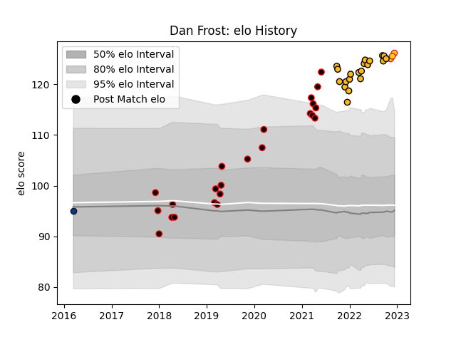

---  
layout: page  
title: Dan Frost  
date: 2023-01-06 00:14:56.930864  
categories: player  
---
# Dan Frost

## Positions: H

## Current elo: 126.0

## Current Percentile: 97.0

# Elo History

# Match History

| Team            |   Appearances |   Win Rate |
|:----------------|--------------:|-----------:|
| Cornish Pirates |            42 |   0.595238 |
| Wasps           |            21 |   0.404762 |
| Exeter Chiefs   |             5 |   0.6      |
| Bath Rugby      |             1 |   0        |

| Opponent            |   Matches |   Win Rate |
|:--------------------|----------:|-----------:|
| Newcastle Falcons   |         5 |   0.2      |
| Hartpury College    |         4 |   1        |
| Bedford             |         4 |   0.75     |
| Nottingham          |         4 |   0.75     |
| Coventry            |         4 |   0.5      |
| Doncaster           |         4 |   0.75     |
| Ealing Trailfinders |         4 |   0.25     |
| London Irish        |         4 |   0.625    |
| Richmond            |         4 |   1        |
| London Scottish     |         3 |   0.333333 |
| Jersey              |         3 |   0        |
| Gloucester Rugby    |         3 |   0.333333 |
| Bristol Rugby       |         3 |   0.333333 |
| Sale Sharks         |         2 |   0        |
| Northampton Saints  |         2 |   0        |
| Saracens            |         2 |   0.5      |
| Worcester Warriors  |         2 |   0.5      |
| Ampthill            |         2 |   1        |
| Leicester Tigers    |         2 |   0.5      |
| Bath Rugby          |         2 |   1        |
| Munster             |         1 |   0        |
| Harlequins          |         1 |   0        |
| Exeter Chiefs       |         1 |   0        |
| Stade Toulousain    |         1 |   1        |
| Castres Olympique   |         1 |   1        |
| Yorkshire Carnegie  |         1 |   1        |